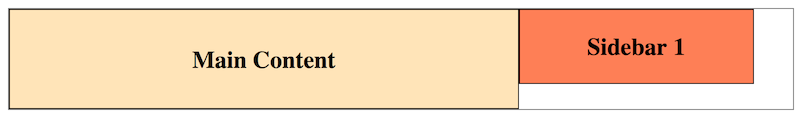
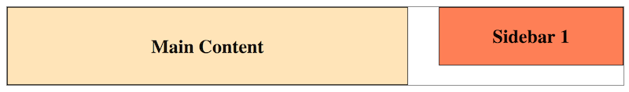
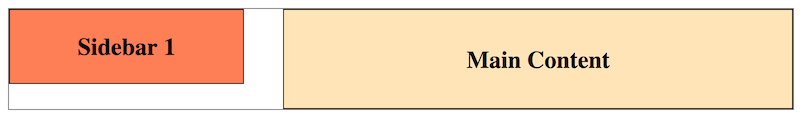

# Floats - 9/26/2020

For positioning elements side-by-side, we've so far relied on `display: inline;` or `display: inline-block;`, but this leads to the use of some nasty hacks to manage whitespace between such elements that disrupt their expected positioning. In such situations, **floats** come in handy. A floated element tells the browser to move it as far to the left or right as possible while leaving the remaining space available for other content (and not consumed with whitespace.)

Floated elements remain in their immediate container, limiting how far left or right the browser will move them. If two elements in a row are floated the same direction (assuming they both fit in the same row), their sides (including margin!) will touch. No other whitespace than the two elements' padding and margin will appear.

```html
<div class="outer">
  <div class="primary">
    <p>Main Content</p>
  </div>

  <div class="secondary">
    <p>Sidebar 1</p>
  </div>
</div>
```

```css
html {
  font-size: 16px;
}

* {
  margin: 0;
  padding: 0;
}

body {
  padding: 0.5rem;
}

p {
  color: black;
  font-family: serif;
  font-size: 1.5rem;
  font-weight: bold;
}

.outer {
  border: 1px solid gray;
  overflow: hidden;
  width: 100%;
}

.primary, .secondary {
  border: 1px solid black;
  box-sizing: border-box;
  text-align: center;
}

.primary {
  background-color: moccasin;
  float: left;
  height: 100px;
  line-height: 100px;
  width: 65%;
}

.secondary {
  background-color: coral;
  float: left;
  height: 75px;
  line-height: 75px;
  width: 30%;
}
```



If we want to add space between the two floated elements, we can calculate margin (right margin to the left element and/or left margin to the right element, assuming we don't exceed the available horizontal width of the container.) Or we can simply float the right element the other direction:

```css
.secondary {
  float: right;
}
```



A major advantage to floats is that we can adjust where elements appear by changing our one CSS file instead of having to change all of our HTML. E.g., suppose we wanted to reposition our sidebar on the left instead of the right; we can just change the direction each is floated:

```css
.primary {
  float: right;
}

.secondary {
  float: left;
}
```



What happens when floated elements of various sizes don't all fit on a single row?

```html
<div class="outer">
  <div class="primary">
    <p>Main Content</p>
  </div>

  <div class="secondary">
    <p>Sidebar 1</p>
  </div>

  <div class="secondary">
    <p>Sidebar 2</p>
  </div>

  <div class="secondary">
    <p>Sidebar 3</p>
  </div>

  <div class="tertiary">
    <p>Another Sidebar</p>
  </div>

  <div class="secondary">
    <p>Sidebar 4</p>
  </div>

  <div class="tertiary">
    <p>Another Sidebar 2</p>
  </div>

  <div class="secondary">
    <p>Sidebar 5</p>
  </div>

  <div class="secondary">
    <p>Sidebar 6</p>
  </div>

  <div class="secondary">
    <p>Sidebar 7</p>
  </div>

  <div class="secondary">
    <p>Sidebar 8</p>
  </div>
</div>
```

```css
.primary, .secondary, .tertiary {
  border: 1px solid black;
  box-sizing: border-box;
  text-align: center;
}

.tertiary {
  background-color: powderblue;
  float: left;
  height: 200px;
  line-height: 200px;
  width: 40%;
}
```


The result is wild. There are rules to this mess, but you don't need to know them. Just keep your use of floats simple: make sure all floats in a group have the same height and direction and they will wrap logically. You can mix float directions if you're careful and if heights are consistent. Or, best of all, use Flex, Grid, or a framework as we'll soon discuss.
