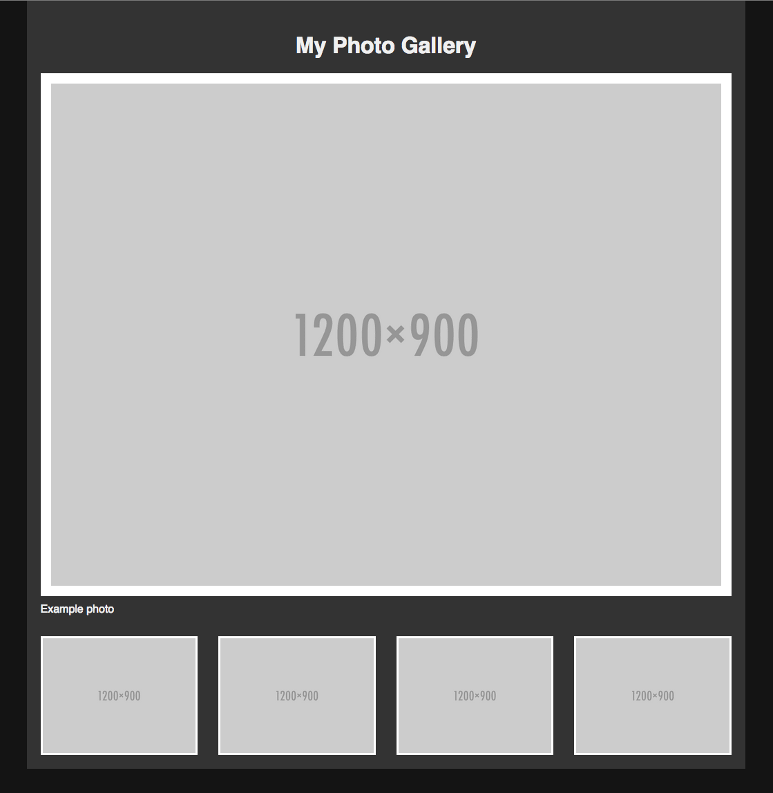

# On Your Own: Fluid Photo Gallery - 9/30/2020

In this project, your job is to replicate the photo gallery shown below. It shows a single photo at the full width of the column, followed by four smaller thumbnail images in a single row below it. All of these should adjust their widths to take up the same percentage width no matter what the main gallery width is.

The box that encloses the entire gallery should have a minimum and maximum width of 500px and 1000px, respectively. Use your best judgment to determine other size and color measurements.

If you don't have photos to use, you can generate some placeholders using the `http://placehold.it/1200x900`, where 1200 is the width, and 900 is the height. Use these same dimensions for the images you create.

You should wrap the central photo in a figure element and use a `figcaption` tag for the caption below it. You'll have to remove the default styles applied to the figure element by the browser to make it take up the entire column width.

Use any technique you want to arrange the thumbnail elements. You can use something traditional like `inline-block` or `float`, or something newer and more interesting like Flex and Grid.
Solution

You can view our [completed example of this assignment](https://d3jtzah944tvom.cloudfront.net/202/projects/lesson_6/photo_gallery_with_fluid_layout/example.html) if you're stuck. (We used `inline-block` in our solution, but we designed this project before Flex and Grid were widely available.)

We also have a video that walks you through creating this project. The instructor uses a Photoshop design file in the video to measure component sizes and colors. We'll discuss design files a bit in the next lesson, but since Photoshop no longer has a reasonable trial period, we no longer go into using Photoshop design files for building projects.

The instructor also uses a negative margin at one point; if interested, you can read up on negative margins [here](https://www.smashingmagazine.com/2009/07/the-definitive-guide-to-using-negative-margins/).

### Solution

[fluid_photo_gallery](fluid_photo_gallery/)

#### Adjustments based on provided solution

* Put thumbnails in a list - more semantically correct than a `div`.
