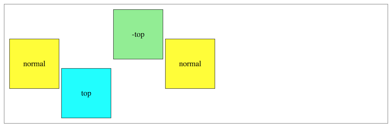

# Positioning - 9/28/2020

Positioning rules can be a bit complicated, but they are useful for fine-tuning the placement of elements within their containers or overlaying an element over another one. We will cover the basics; consider external tutorials in the future.

## Offset Properties

Offset properties (`top`, `right`, `bottom`, and `left`) work with `position` to determine which direction an element is moved and how far. Remember that positive offset values are always **inward**, e.g. `bottom: 50px;` moves an element 50px **up**! Negative offset values will go the other direction (outward).

## The `position` Property

`position` tells the browser how to position the specified element.

### `position: static;`

Static positioning is the default. Static elements are in the normal page flow (float, grid, flex, absolute positioning, and fixed positioning all remove elements from the normal page flow.) Offset properties **do not** affect static elements.

### Relative Position

`position: relative;` moves an element to a new position relative to its static position (where the browser would normally place it.) E.g. an element with `position: relative;`, `left: 50px;`, and `bottom: 100px;` will be shifted 50px inward from the left edge and 100px inward from the bottom edge (of its normal static position.) When using relative positioning, you should usually not provide more than one horizontal offset nor more than one vertical offset, though CSS allows you to provide more. If you do:

* `top` always overrides `bottom`
* `left` overrides `right` for left-to-right languages
* `right` overrides `left` for right-to-left languages

Relative positioning **does not** remove an element from the document flow. A subsequent element is positioned in the same place as it would normally be:

```html
<section>
  <aside class="normal">normal</aside>
  <aside class="shifted pos">top</aside>
  <aside class="shifted neg">-top</aside>
  <aside class="normal">normal</aside>
</section>
```

```css
section {
  border: 1px solid gray;
  padding: 70px 10px;
}

aside {
  border: 1px solid black;
  display: inline-block;
  height: 100px;
  line-height: 100px;
  margin: 0;
  padding: 0;
  text-align: center;
  width: 100px;
}

.normal {
  background-color: yellow;
}

.shifted {
  position: relative;
}

.pos {
  background-color: cyan;
  top: 60px;
}

.neg {
  background-color: lightgreen;
  top: -60px;
}
```



Since surrounding elements respect the space a relative positioned element would normally occupy (if statically positioned), we can accomplish overlays:

```html
<section>
  <aside class="normal">normal</aside>
  <aside class="shifted pos">right</aside>
  <aside class="shifted neg">-right</aside>
  <aside class="normal">normal</aside>
</section>
```

```css
section {
  padding: 10px;
}

.pos {
  /* bottom: 60px; */.
  right: 60px;
}

.neg {
  /* bottom: -60px; */.
  right: -60px;
}
```


### Absolute Position

`position: absolute;` moves an element to a new position within a container element. By default, the container is the nearest ancestor element with a position other than static - either fixed, absolute, relative, or sticky (we don't discuss sticky in this course.) If no such ancestor is present, the browser will use the initial containing block (`body`.) This **does** remove an element from the document flow.

```html
<section>
  <aside class="relative">
    <div class="absolute-1"></div>
  </aside>
  <aside class="relative">
    <div class="absolute-2"></div>
  </aside>
  <aside class="relative">
    <div class="absolute-3"></div>
  </aside>
</section>
```

```css
section {
  border: 1px solid gray;
  padding: 10px 10px 60px;
  width: 780px;
}

aside {
  border: 1px solid black;
  display: inline-block;
}

.relative {
  background-color: yellow;
  height: 200px;
  left: 0;
  margin: 0 25px;
  position: relative;
  top: 0;
  width: 200px;
}

.absolute-1 {
  background-color: lightgreen;
  bottom: 33%;
  left: 33%;
  position: absolute;
  right: 33%;
  top: 33%;
}

.absolute-2 {
  background-color: cyan;
  bottom: 150px;
  left: 0;
  position: absolute;
  right: 20px;
  top: 0;
}

.absolute-3 {
  background-color: pink;
  bottom: -50px;
  left: 100px;
  position: absolute;
  right: -40px;
  top: 150px;
}
```


* The yellow boxes (with relative position) are our containers; recall that an absolute position element requires a parent with relative, absolute, or sticky position, else it uses `body`.
* Green demonstrates using absolute position to center an element within its container (this will **not** work if green has an explicity `height` or `width`.)
* Pink shows negative offsets to move an element outside its container.

Since `position: absolute;` removes an element from the normal document flow, the browser will not treat that elements space as occupied. Notice how the `static` black box acts as if none of the other elements are there:

```html
<section>
  <aside class="relative">
    <div class="absolute-1"></div>
    <div class="absolute-2"></div>
    <div class="absolute-3"></div>
    <div class="unpositioned"></div>
  </aside>
</section>
```

```css
.unpositioned {
  background-color: black;
  height: 100px;
  width: 100px;
}
```


### Fixed Position

`position: fixed;` places an element on a fixed position within the window and it **does not** move. This is frequently seen with navigation bars that stay at the top of the window even as you scroll down the page. Run the following code as an example:

```html
<header>
  Fixed Position Demo
</header>

<section>
  <p>
    This part of the window scrolls up and down.
  </p>
  <p>
    Sint cillum tempor esse eu laborum ipsum eu. Cupidatat sint laboris
    excepteur eu enim adipisicing officia. Sunt cupidatat id ipsum reprehenderit
    et irure veniam ex. Duis cupidatat ullamco adipisicing mollit ea nulla irure
    mollit eu. Aliqua laboris aute sint consectetur aute occaecat cillum sint
    aliqua. Culpa eiusmod officia Lorem dolore.
  </p>
  <p>
    Dolor proident mollit eiusmod. Cupidatat Lorem ipsum irure culpa quis. Non
    consequat sunt non nostrud sint id quis consectetur aute. Exercitation nisi
    tempor excepteur. Magna exercitation ad amet ut commodo consequat non. Duis
    veniam culpa esse magna laborum aute sunt quis.
  </p>
  <!-- add several more paragraph here -->
</section>
```

```css
header {
  background-color: lightgreen;
  font-size: 4rem;
  height: 8rem;
  left: 0;
  line-height: 8rem;
  opacity: .75;
  position: fixed;
  text-align: center;
  top: 0;
  width: 100%;
}

section {
  margin: 0 auto;
  padding: 10rem 1rem 0;
  width: 600px;
}

p {
  font-size: 2rem;
  margin-bottom: 1.5rem;
}
```
