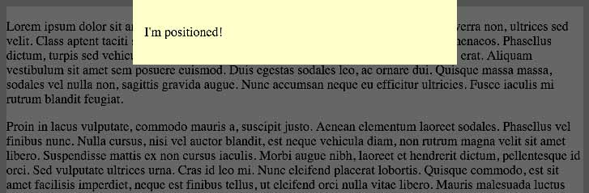

# Practice Problems: Positioning - 9/28/2020

For these problems, create a simple HTML page with a few paragraphs of text. You should have enough content that you must scroll the browser window to read the bottommost content; you can also shorten the window height if you prefer. If you add any elements to the page, add them after the paragraph elements.

1. Starting with a new document, create an element and position it at the top right of the page. It should scroll with the rest of the window when you scroll.

### Solution

```html
<!-- ... -->
  <div>
    <p>I'm positioned!</p>
  </div>
</body>
```

```css
div {
  background-color: yellow;
  display: inline-block;
  padding: 1em;
  position: absolute;
  right: 0;
  top: 0;
}
```

### Adjustments based on provided solution

* Background color is `#ffc`.
* Accomplish positioning via `positioned` ID.
* No need for a paragraph within the `div`.
* 30px vertical padding, 15px horizontal padding.

```html
<!-- ... -->
  <div>I'm positioned!</div>
</body>
```

```css
#positioned {
  background-color: #ffc;
  padding: 30px 15px;
  position: absolute;
  right: 0;
  top: 0;
}
```
---

2. Change the element to remain in the top right of the viewport when the window scrolls.

### Solution

```css
#positioned {
  /* ... */
  position: fixed;
}
```

---

3. Set the element's width to 400px and center it horizontally. Centering positioned elements is tricky, so feel free to check the hints and use Google.

> Hint 1: How would you position the left-most edge of the element at the halfway point of the container? Consider using a percentage offset.

> Hint 2: Once you have the element at the halfway point as described by the previous hint, you need to move it back in the opposite direction to center the element's midpoint. How can you do this? Consider using a negative left margin to pull the element to the left. If interested, you can read up on negative margins [here](https://www.smashingmagazine.com/2009/07/the-definitive-guide-to-using-negative-margins/).

### Solution

```css
#positioned {
  /* ... */
  left: 50%;
  margin-left: -25%;
  /* DELETE right: 0; */
  width: 400px;
}
```

#### Adjustments based on provided solution

`margin-left: -25%;` is wrong; it only appeared to work because of the width of my browser window (it's important to resize your window when testing!) Since the element being centered has a fixed width, the **negative** left margin needs to be half the size of its width: `margin-left: -200px;`.

---

4. Place a new element between the page contents and the yellow item; by between, we mean in a 3D sense. Consider the page content to be at the bottom of a stack and the yellow at the top; place the new element between the two.

The new element should take up the full width and height of the page. Use the CSS below to get started; note that it sets the background to a translucent color. The new element should fill the browser's entire window, and it should appear in front of the paragraphs but behind the yellow box.

```
background-color: rgba(0, 0, 0, .6);
```



> Hint: Read about the `z-index` property.

### Solution

```html
<!-- ... -->
  <div id="positioned">I'm positioned!</div>

  <div id="between-3d"></div>
</body>
```

```css
#positioned {
  /* ... */
  z-index: 3;
}

#between-3d {
  background-color: rgba(0, 0, 0, .6);
  bottom: 0;
  left: 0;
  position: fixed;
  right: 0;
  top: 0;
  z-index: 2;
}
```

---

5. Create a new element inside the `#positioned` container. Starting with the CSS below, move the new item partially outside the parent's boundaries by 10px to the left and top. To ensure you can see everything, move the parent element down from the top of the page.

```css
... {
  /* code omitted */
  background-color: pink;
  height: 20px;
  width: 20px;
}
```

### Solution

```html
<div id="positioned">
  <div id="overlay"></div>
  I'm positioned!
</div>
```

```css
#positioned {
/* ... */
  top: 20px;
}

#overlay {
  background-color: pink;
  height: 20px;
  left: -10px;
  position: absolute;
  top: -10px;
  width: 20px;
}
```
