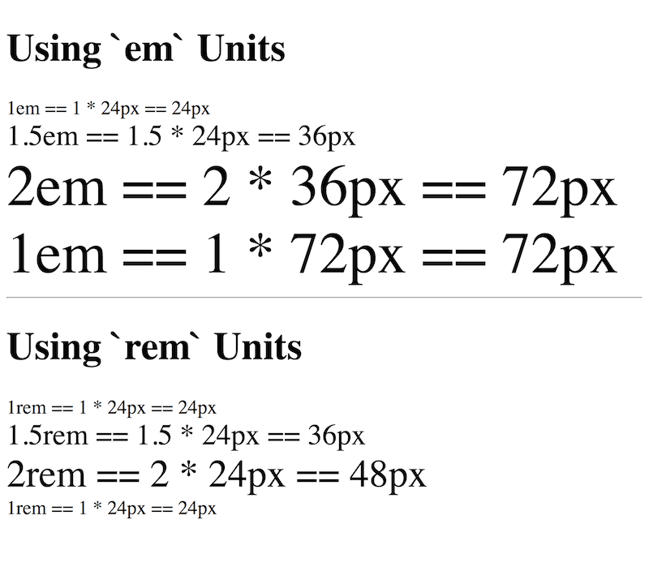
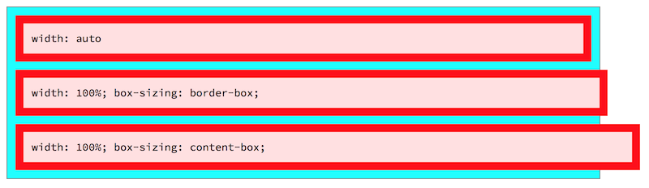

# Dimensions - 9/7/2020

## Absolute Units

CSS has one absolute unit of significance: the **pixel**. However, we need to distinguish between physical and reference pixels.

A physical/device/display pixel is a single spot if light on a device's display. This used to be absolute, but with the proliferation of different sized devices and the advent of high density displays (like Apple's Retina display), physical pixels are no longer as uniform as they used to be.

A **CSS reference pixel** is the size of a physical pixel on a display that has 96 pixels per inch. High resolution displays usually have 192 pixels per inch. To account for the difference, CSS will use 4 pixels on a high density display for each CSS reference pixel.

There's one more piece to consider, the **typical viewing distance (TVD)** of a display. The CSS reference pixel is defined based on the angular diameter of a CSS pixel at a device's TVD (how big the pixel appears to be at a certain distance, the TVD.) For example, a phone's TVD is ~14 inches, while a 27 inch desktop display's TVD is ~33 inches. If you hold the phone and 27 inch display side-by-side and view the same image, it will look different sizes. However, if you hold each device at its TVD, the images should appear to be the same size.

There are other absolute units, such as inches and millimeters, but their sizing is rarely what you expect. These are rarely used.

## Relative Units

`em` versus `rem`
* `em`s are proportional to the **calculated** font size: the *height* of the current font in pixels
* `rem`s are proportional to the **root** font size (the *height* of the `html` element's font size in pixels)

For example, if the calculated font size is `20px` and the root font size = `16px`...
* `1.5em`  = `30px` (20 * 1.5)
* `1.5rem` = `24px` (16 * 1.5)

> In most cases, you should use **pixels** to specify the root font size. Some developers use ems or rems to give the user more control over font size, but this usually results in odd behavior such as elements overflowing, overlapping, or rearranging on the page.

> Bugs in older browsers make it a good idea to set the root font size in both the `html` element and the `body` element. Always use **pixels** when doing so.

`rem`s are usually easier to work with than `em`s since, once you've set the root font size, `1.5rem` is the same size everywhere in the document. This is not the case for `em`s; they compound:

```html
<h1>Using `em` Units</h1>
<div class="a-em">
  1em == 1 * 24px == 24px
  <div class="b-em">
    1.5em == 1.5 * 24px == 36px
    <div class="c-em">
      2em == 2 * 36px == 72px
      <div class="a-em">
        1em == 1 * 72px == 72px
      </div>
    </div>
  </div>
</div>

<hr />

<h1>Using `rem` Units</h1>
<div class="a-rem">
  1rem == 1 * 24px == 24px
  <div class="b-rem">
    1.5rem == 1.5 * 24px == 36px
    <div class="c-rem">
      2rem == 2 * 24px == 48px
      <div class="a-rem">
        1rem == 1 * 24px == 24px
      </div>
    </div>
  </div>
</div>
```

```css
html, body { font-size: 24px; }

.a-em { font-size: 1em; }
.b-em { font-size: 1.5em; }
.c-em { font-size: 2em; }

.a-rem { font-size: 1rem; }
.b-rem { font-size: 1.5rem; }
.c-rem { font-size: 2rem; }
```



This compounding makes `em`s hard to use and maintain. Some older browsers, though, don't recognize `rem`s; if you must support such browsers, use a fallback unit:

```css
p {
  font-size: 20px; font-size: 1.25rem;
}
```

This CSS tells the browser to use `1.25rem` as the font size. If the browser doesn't recognize `rem`s, it falls back to `20px`. Placing both values on the same line makes the presence of a fallback easier to see, but it isn't required.

> We chose `20px` as the fallback value since most (not all) browsers default to `16px`, which makes `1.25rem` equivalent to `20px`. If you must use fallbacks, assuming a `16px` default font-size is your best bet.

### Percentages

CSS doesn't technically consider percentages a length value, but this doesn't matter much now.

#### Auto

`auto` also isn't a length value, but you can use it to let the browser determine a width or height for you. Common uses:

* `width` or `height` of `auto` tells the browser to try to it the entire element (**including its margins) inside its container. (**NB**: this is different than `width: 100%;`; see below.)
* As horizontal `margin`, `auto` tells the browser to push an element all the way to the left (with `margin-right: auto;`), all the way to the *right* (with `margin-left: auto;`), or to center it (with left and right margins as `auto`.)
* `auto` for vertical margins is equivalent to `0`.
* Padding does not accept `auto` values.

```html
<div id="auto-width">
  <div id="auto-width-auto">width: auto</div>
  <div id="auto-width-100-border">width: 100%; box-sizing: border-box;</div>
  <div id="auto-width-100-content">width: 100%; box-sizing: content-box;</div>
</div>
```

```css
#auto-width {
  background-color: cyan;
  border: 1px solid gray;
  font-family: monospace;
  text-align: center;
  width: 730px;
}

#auto-width div {
  background-color: #ffe0e0;
  border: 10px solid red;
  margin: 10px;
  padding: 10px;
  text-align: left;
}

#auto-width-auto {
  width: auto;
}

#auto-width-100-border {
  box-sizing: border-box;
  width: 100%;
}

#auto-width-100-content {
  box-sizing: content-box;
  width: 100%;
}
```




## Units

`0` doesn't require units; it's the same for all units.

You can freely mix and match relative and absolute units. Just be careful; this can make calculations difficult once elements are nested more than a couple of levels.

Some suggestions for determining which units to use (these are not absolute):
* absolute units: use them sparingly and stick with pixels; good for:
  * root font size
  * image width and height
  * top and bottom margins and padding; sometimes left and right margins and padding
  * width or height of fixed-width/height containers, such as navigation sidebars
  * border widths
* relative units: use them liberally
  * rems for fonts (fallback with ems or pixels if needed); stick with pixels for root font
  * if you have to use ems, avoid compounding
  * left and right margins and padding
  * use `%` for elements that are proportional to the dimenions of their container; excellent for when areas need to shrink or grow with the viewport
  * `auto` with `width` and `height` to let browser calculate appropriate values
  * `auto` with horizontal margins to left, center, or right justify a block element within its container (and leave its content unaffected.)
