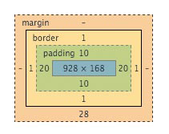

# Everything is a Box - 9/3/2020

Simplified mental model of HTML rendering: consider a word processor that renders words from left to right as space allows, then moves vertically to a new line when out of horizontal space. HTML rendering in browsers is similar with elements taking the place of words:

* every element requires a box-shaped segment of the page
* every character of text content also needs a boxed portion of the page
* browser calculates the dimensions of that box by using browser defaults and CSS

`display: inline-block`: elements laid out side-by-side up to the page width; if one doesn't fit, browser moves to a new line (like words in our above example)

Box Properties

* **width** and **height**: define how much horizontal and vertical space is needed for the box's *content area* (which may or may not include padding and borders)
* **padding**: surrounds the content area and separates it from the border; typically opaque and hides anything it overlays
* **border**: boundary that surrounds the padding
* **margin**: transparent area outside the border that supplies separation between elements
* **display**: determines how the browser lays out an element relative to its neighbors

This diagram shows an element that has a content area that:

* is 928 pixels wide and 168 high
* has 10 pixels each of top and bottom padding plus 20 pixels each of left and right padding
* has a border that is 1 pixel thick
* has a 28-pixel bottom margin (the left, right, and top margins are 0)

Width, height, padding, border, and margin attributes all accept values of 0.
