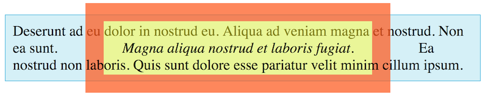

# The Visual Formatting Model - 9/3/2020

The `display` property has more than two dozen values, but most CSS uses `block`, `inline`, or `inline-block`.

### [Block Elements](https://developer.mozilla.org/en-US/docs/Web/HTML/Block-level_elements)

By default, a `block` element stretches to occupy all available horizontal space. Some block elements are headings, paragraphs, sections, tables, forms, and lists. Non block elements can be converted to block with `display: block`.

Most `block` elements group one or more other elements (some of which may themselves be blocks) into areas of the page, e.g. `header` elements. Such `block` elements are often called **containers** (`body` is the outermost container.) Every other element belongs to a container. We often use the term **parent** to refer to a container and **child** to refer to a contained element; this language can be extended to reference other relationships such as grandparent, ancestor, descendant, sibling, cousin, etc.

By default, `width` and `height` exclude `padding` and `border` from the measured content area, but we'll see how this can be changed later. Also, `width` and `height` values never include margins, though margins must be accounted for when determining if an element will fit in a given space. Even though a block element occupies an entire row, this doesn't change its width, e.g. a 500 pixel width block element in a 900 pixel wide space is still 500px wide; the browser leaves the remaining 400px of that row empty.

Size example:
width: 928px
height: 168px
padding: 10px 20px
border: 1px
margin-bottom: 28px
=> overall dimensions of 970 x 218 pixels

### [Inline Elements](https://developer.mozilla.org/en-US/docs/Web/HTML/Inline_elements)

Inline elements are used to add small bits of semantic meaning to content, adjusting appearances slightly so a reader can spot specific things more easily. Default inline elements include: `span`, `b`, `i`, `u`, `strong`, `em`, `a`, `sub`, `sup`, and `img`. Non inline elements can be converted with `display: inline`.

`inline` elements handle dimension properties (`width`, `height`, `padding`, `border`, and `margin`) differently than `block` elements. *Left* and *right* margins and padding are handled the same way as `block`, but...
* `width` and `height` are ignored (except with `img` elements), instead using values computer from the element content
* vertical `padding` isn't ignored but won't be noticed unless you have a border or background
* vertical `border` isn't ignored but results may look odd
* vertical `margin` is ignored

### Borders, Padding, Margins, and Inline Elements

Consider the following HTML and CSS and the associated output:

```html
<p>
  Deserunt ad eu dolor in nostrud eu. Aliqua ad veniam magna et nostrud. Non ea
  sunt. <em>Magna aliqua nostrud et laboris fugiat.</em> Ea nostrud non laboris.
  Quis sunt dolore esse pariatur velit minim cillum ipsum.
</p>
```

```css
p {
  background-color: #d4f0f8;
  border: 1px solid #2db7e1;
  box-sizing: border-box;
  font-size: 1.5rem;
  padding: 0.5em;
  width: 780px;
}

em {
  background-color: rgba(255, 255, 0, .5);
  border: 30px solid rgba(255, 0, 64, .5);
  margin: 40px;
  padding: 30px;
}
```



This example demonstrates how browsers handle borders, padding, and margins with `inline` elements. Here, the border for the `<em>` is orange and the padding yellow. You can't see the margin since it's transparent, but it plainly affects the text to the left and right of the `em` element. The presence of the orange and yellow areas shows that the `em` element has padding and a border on all four sides, but the text above and below the element ignores them. In fact, through the magic of CSS opacity (transparency), we can see the `em` border and padding overlay the text above it, while the content below it overlays the border and padding.

One more item to note here is that the top and bottom borders extend beyond the boundaries of the `p` element. The padding would do that as well if we increased it by a few more pixels.

You need to understand this behavior more as something to avoid than to make use of it. You can waste a lot of time trying to use borders, padding, and margins with inline elements when you're not expecting this behavior. The main idea is that the left/right factors affect the flow, while the top and bottom do not.

### Inline-Block Elements

> The `inline-block` visual display model is a *legacy* model. It is equivalent to a new model called `inline flow-root`. However, despite its legacy status, `inline-block` is probably not going to go away anytime soon; there are too many websites that still use it. We will use `inline-block` throughout this course; it will probably be several years before `inline flow-root` and other new display models gain traction.

`inline-block` is a mixture of `inline` and `block`: `inline-block` elements act like `block` elements except they don't fill an entire row when their `width` is less than the available width. Instead, they flow normally until the space is filled; this allows the placement of `inline-block` elements side-by-side other `inline` or `inline-block` elements. Non `inline-block` elements can be converted with `display: inline-block`. This is often useful for displaying lists horizontally (as is commonly done for navigation bars.)


`width` and `height` properties are not ignored; `padding`, `border`, and `margin` are treated the same way as with `block` elements

Browsers handle vertical alignment of adjacent `inline` and `inline-block` elements. This can be adjusted with the `vertical-align` property, which can be set to `bottom`, `middle`, or `top`.

Browsers have some discretion when it comes to which elements are `inline` or `inline-block`, e.g. `input` and `textarea` are `inline-block` in Chrome and Safari but `inline` in Firefox. This usually won't cause problems, but you should be aware of it just in case.

It's invalid to nest `block` and `inline-block` elements inside `inline` elements, e.g. `em` (inline) may be nested inside `blockquote` (block) but not vice versa. Browsers may render improperly nested elements correctly, but you should **NOT** depend on this behavior. HTML validators are helpful in detecting these issues, and they should almost always be corrected. One exception: `block` and `inline-block` elements may be nested inside an `a` element IF the block does not include interactive elements such as `input`, `button`, `select`, `textarea`, or another `a` (you probably won't use this exception, however.)
