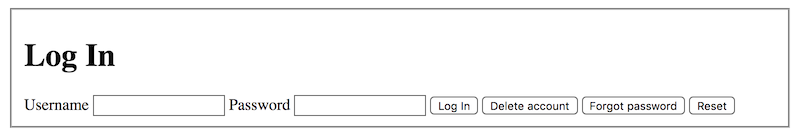

# Forms Overview - 9/23/2020

Forms are the intersection of front-end and back-end concerns; they:
* display information to the user
* solicit user input
* can perform basic validation
* send form data to the server

**NB:** Forms don't update data on the server themselves, they merely submit form data to the server. A back-end language such as Ruby accepts the data and performs followup actions, such as updating server data.

## The `form` Tag

The `form` tag is the parent/container for all other form-related tags. Its most important attributes are:
* `action`: provides the URL to which the browser submits requests; individual action items (`button` and `input type="submit"`) can override this via the `formaction` attribute.
* `method`: tells the browser whether to use GET or POST (Javascript or a backend application must be used to access the other HTTP methods.) Previous GET/POST semantics apply: use `method="get"` for requesting data from the server; use `method="post"` for sending/updating data on the server.

A form should contain at least one `input`, `textarea`, or `select` tag or it's useless. Informally, we often refer to these with the terms control, widget, or input.

## The `fieldset` Tag

`fieldset` is an optional tag for grouping form content into related sets of data. This is useful for providing semantic meaning via the groupings. Many browsers will also draw a line around fieldsets by default, but this can be overriden via CSS.

```html
<form action="/login" method="post">
  <fieldset>
    <input type="text" name="username" />
    <input type="password" name="password" />
  </fieldset>
  <fieldset>
    <input type="submit" value="Save" />
    <input type="submit" value="Forgot Password" formaction="/forgot" />
  </fieldset>
</form>
```

## The `input` Tag

The `input` tag is a self-closing tag that describes a control or widget for submitting information or a request to the server. The `type` attribute is required (there are many, most new as of HTML5.) E.g. `type="text"` provides a space for a user to enter some text; `type="submit"` displays a button for submitting the form to the server. Most `input` types also require a `name`; browsers use names to identify each data item in the form; servers use names to find appropriate values in submitted form data. We'll learn more in the next lesson.

```html
<input type="text" name="city" />
<input type="password" name="password" />
<input type="submit" value="Save" />
```

## The `label` Tag

The `label` tag provides two ways to associate descriptive text with an input field. There are also so UX advantages: a user can click on the label to focus the associated input field.

The `for` method: the `<label>` tag's `for` attribute is used with the `<input>` tag's `id` attribute to associate the two elements:

```html
<label for="phone">Phone</label>
<input type="text" id="phone" name="phone_number" />
```

The container method eliminates the need for `for` and `id` attributes, but this can make styling more difficult:

```html
<label>
  Phone
  <input type="text" name="phone" />
</label>
```

### A Complete Form Example

This form has two input fields, `username` and `password`, each with a label, and four buttons.

```html
<form action="#" method="post">
  <fieldset>
    <h1>Log In</h1>
    <label for="username">Username</label>
    <input type="text" name="username" id="username" />

    <label for="password">Password</label>
    <input type="password" name="password" id="password" />

    <input type="submit" value="Log In" />
    <input type="submit" value="Delete account"
           formaction="/account/delete" />
    <input type="submit" value="Forgot password"
           formaction="/account/password" />
    <input type="reset" value="Reset" />
  </fieldset>
</form>
```



The `formaction` on the `Delete account` and `Forgot password` buttons lets us use the same form to perform three different actions. If you click either button instead of the `Log In` button, the browser sends the form information to the address given by `formaction`. Otherwise, it sends it to the address given by `action` in the `form` tag.

Hmm, that last form looks strange with all the inputs together on one line. Let's use a few `fieldset` tags to arrange them more attractively.

```html
<form action="#" method="post">
  <fieldset>
    <h1>Log In</h1>
    <fieldset>
      <label for="username">Username</label>
      <input type="text" name="username" id="username" />
    </fieldset>

    <fieldset>
      <label for="password">Password</label>
      <input type="password" name="password" id="password" />
    </fieldset>

    <fieldset>
      <input type="submit" value="Log In" />
      <input type="submit" value="Delete account"
             formaction="/account/delete" />
      <input type="submit" value="Forgot password"
             formaction="/account/password" />
      <input type="reset" value="Reset" />
    </fieldset>
  </fieldset>
</form>
```

```css
fieldset {
  border: none;
}
```


Note that we disabled the `fieldset` border that most browsers draw by default.
