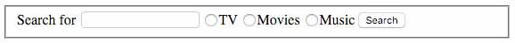

# Practice Problems: Forms - 9/24/2020

1. Create a contact form that collects the user's first name, last name, email address, and phone number. Be sure to require all inputs and to use appropriate input types and labels. Prevent Chrome and iOS Safari from doing any auto-actions (e.g., autocomplete and autocorrect) on the email input.

For this problem, don't use a definition list to organize your form. We'll do that in the next question.

### Solution

```html
<form action="#" method="post">
  <fieldset>
    <label for="first_name">First Name</label>
    <input type="text" name="first_name" id="first_name" required />

    <label for="last_name">Last Name</label>
    <input type="text" name="last_name" id="last_name" required />

    <label for="email">Email Address</label>
    <input type="email" name="email" id="email" required
           autocomplete="off" autocorrect="off" />

    <label for="phone">Phone Number</label>
    <input type="tel" name="phone" id="phone" required />
  </fieldset>
</form>
```

#### Adjustments based on provided solution

Add `autocapitalize="none"` to email field. Form is useless without a submit button:

`<input type="submit" />`

---

2. Convert the HTML from the previous problem to use a single description list to pair each label and input control.

### Solution

```html
<form action="#" method="post">
  <fieldset>
    <dl>
      <dt><label for="first_name">First Name</label></dt>
      <dd><input type="text" name="first_name" id="first_name" required /></dd>

      <dt><label for="last_name">Last Name</label></dt>
      <dd><input type="text" name="last_name" id="last_name" required /></dd>

      <dt><label for="email">Email Address</label></dt>
      <dd><input type="email" name="email" id="email" required
             autocomplete="off" autocorrect="off" autocapitalize="none" /></dd>

      <dt><label for="phone">Phone Number</label></dt>
      <dd><input type="tel" name="phone" id="phone" required /></dd>
    </dl>

    <input type="submit" value="Submit" />
  </fieldset>
</form>
```

---

3. Add a `select` box to your solution from the previous problem that lets the user select a phone type given the options "home," "business," and "mobile." Make sure you pre-select the "home" option.

### Solution

```html
<form action="#" method="post">
  <fieldset>
    <dl>
      <dt><label for="first_name">First Name</label></dt>
      <dd><input type="text" name="first_name" id="first_name" required /></dd>

      <dt><label for="last_name">Last Name</label></dt>
      <dd><input type="text" name="last_name" id="last_name" required /></dd>

      <dt><label for="email">Email Address</label></dt>
      <dd><input type="email" name="email" id="email" required
             autocomplete="off" autocorrect="off" autocapitalize="none" /></dd>

      <dt><label for="phone">Phone Number</label></dt>
      <dd><input type="tel" name="phone" id="phone" required /></dd>

      <dt><label for="phone_type">Phone Type</label></dt>
      <dd>
        <select name="phone_type" id="phone_type">
          <option value="home" selected>Home</option>
          <option value="business">Business</option>
          <option value="mobile">Mobile</option>
        </select>
      </dd>
    </dl>

    <input type="submit" value="Submit" />
  </fieldset>
</form>
```

---

4. Add a message box to your solution from the previous problem that lets the user enter an optional multi-line message. The message box should allow around six lines of text of up to about 80-characters each.

### Solution

```html
<form action="#" method="post">
  <fieldset>
    <dl>
      <dt><label for="first_name">First Name</label></dt>
      <dd><input type="text" name="first_name" id="first_name" required /></dd>

      <dt><label for="last_name">Last Name</label></dt>
      <dd><input type="text" name="last_name" id="last_name" required /></dd>

      <dt><label for="email">Email Address</label></dt>
      <dd><input type="email" name="email" id="email" required
             autocomplete="off" autocorrect="off" autocapitalize="none" /></dd>

      <dt><label for="phone">Phone Number</label></dt>
      <dd><input type="tel" name="phone" id="phone" required /></dd>

      <dt><label for="phone_type">Phone Type</label></dt>
      <dd>
        <select name="phone_type" id="phone_type">
          <option value="home" selected>Home</option>
          <option value="business">Business</option>
          <option value="mobile">Mobile</option>
        </select>
      </dd>

      <dt><label for="message">Message</label></dt>
      <dd>
        <textarea name="message" id="message" rows="6" cols="80"></textarea>
      </dd>
    </dl>

    <input type="submit" value="Submit" />
  </fieldset>
</form>
```

---

5. Add some placeholder text to the phone number input that shows the format you expect to see. (For instance, `###-###-####`.)

### Solution

```html
<dt><label for="phone">Phone Number</label></dt>
<dd>
  <input type="tel" name="phone" id="phone" placeholder="###-###-####"
         required />
</dd>
```

---

6. Add some placeholder text to the message box, e.g., `Type your message here.`.

```html
<dt><label for="message">Message</label></dt>
<dd>
  <textarea name="message" id="message" rows="6" cols="80"
            placeholder="Type your message here.">
  </textarea>
</dd>
```

---

7. Create a search form with three items:

* a field for the search term,
* a group of three controls to select precisely one from the list "TV," "Movies," and "Music,"
* a Search button (use the `button` tag, not the obsolete `<input type="button" />` tag).

The form doesn't have to do anything when submitted. Don't use a description list for this problem.



### Solution

```html
<form action="#" method="get">
  <fieldset>
    <label for="search_term">Search for</label>
    <input type="text" name="search_term" id="search_term" required />

    <input type="radio" name="search_medium" value="TV" />
    <input type="radio" name="search_medium" value="Movies" />
    <input type="radio" name="search_medium" value="Music" />

    <button type="submit">Search</button>
  </fieldset>
</form>
```

#### Adjustments based on provided solution

There is a search input type.
Use container style labels for radios. Make radios required.

```html
<form action="#" method="get">
  <fieldset>
    <label for="search_term">Search for</label>
    <input type="search" name="search_term" id="search_term" required />

    <label>
      <input type="radio" name="search_medium" value="tv" required />
      TV
    </label>

    <label>
      <input type="radio" name="search_medium" value="movies" required />
      Movies
    </label>

    <label>
      <input type="radio" name="search_medium" value="music" required />
      Music
    </label>

    <button type="submit" name="search">Search</button>
  </fieldset>
</form>
```

---

8. Create a review form with a single control that lets the user select from the movies "Looper," "Frozen," and "Tommy Boy," then add a numeric rating field that the user can set to any integer from 1-5. Next, add a toggle control to add the movie to your favorites list. Enable the toggle control by default. Lastly, add a submit button.

### Solution

```html
<form action="#" method="post">
  <fieldset>
    <label for="movie">Movie</label>
    <select name="movie" id="movie">
      <option selected>Looper</option>
      <option>Frozen</option>
      <option>Tommy Boy</option>
    </select>

    <label for="rating">Rating</label>
    <input type="number" min="1" max="5" name="rating" id="rating" />

    <input type="checkbox" name="favorite" id="favorite" checked />
    <label for="favorite">Add to my favorites</label>

    <input type="submit" />
  </fieldset>
</form>
```

---

9. Add the movie "Alien" to the end of the drop-down list and make it the initial selection when displaying the form.

### Solution

```html
<label for="movie">Movie</label>
<select name="movie" id="movie">
  <option>Looper</option>
  <option>Frozen</option>
  <option>Tommy Boy</option>
  <option selected>Alien</option>
</select>
```

---

10. Update your solution to show all four possible choices at once.

### Solution

```html
<label for="movie">Movie</label>
<select name="movie" id="movie" size="4">
  <option>Looper</option>
  <option>Frozen</option>
  <option>Tommy Boy</option>
  <option selected>Alien</option>
</select>
```

---

11. Create a form that filters news articles by a single category and any number of selected tag words. Use radio buttons for the news category and checkboxes for the tags. Make sure you use the `get` method to allow the user to save and share the filtered URL.

* **Categories**: Core, Plugins and Libraries, Conventions, Reviews, Opinion, People
* **Tags**: HTML, CSS, Javascript, Ruby, Rails, Python, Django

For this problem, use the container-style `label` tag (without the `for` attribute). Use an unordered list instead of a description list for both the categories and tags.

### Solution

```html
<form action="#" method="get">
  <fieldset>
    <ul name="category">
      <li>
        <label>
          <input type="radio" name="category" value="core" />
          Core
        </label>
      </li>
      <li>
        <label>
          <input type="radio" name="category" value="plugins_and_libraries" />
          Plugins and Libraries
        </label>
      </li>
      <li>
        <label>
          <input type="radio" name="category" value="conventions" />
          Conventions
        </label>
      </li>
      <li>
        <label>
          <input type="radio" name="category" value="reviews" />
          Reviews
        </label>
      </li>
      <li>
        <label>
          <input type="radio" name="category" value="opinion" />
          Opinion
        </label>
      </li>
      <li>
        <label>
          <input type="radio" name="category" value="people" />
          People
        </label>
      </li>
    </ul>

    <ul>
      <li>
        <label>
          <input type="checkbox" name="tags" value="html" />
          HTML
        </label>
      </li>
      <li>
        <label>
          <input type="checkbox" name="tags" value="css" />
          CSS
        </label>
      </li>
      <li>
        <label>
          <input type="checkbox" name="tags" value="javascript" />
          Javascript
        </label>
      </li>
      <li>
        <label>
          <input type="checkbox" name="tags" value="ruby" />
          Ruby
        </label>
      </li>
      <li>
        <label>
          <input type="checkbox" name="tags" value="rails" />
          Rails
        </label>
      </li>
      <li>
        <label>
          <input type="checkbox" name="tags" value="python" />
          Python
        </label>
      </li>
      <li>
        <label>
          <input type="checkbox" name="tags" value="django" />
          Djando
        </label>
      </li>
    </ul>

    <input type="submit" />
  </fieldset>
</form>
```

#### Adjustments based on provided solution

Add catagory and tag labels as headers. Radios should be required.

---

12. Convert the radios and checkboxes in the filter form to `select` lists. Let the user select any number of tags, and ensure the selection box is large enough that she can see several choices at once. Use description lists to organize the form elements.

### Solution

```html
<form action="#" method="get">
  <fieldset>
    <dl>
      <dt><label for="category">Category</label></dt>
      <dd>
        <select name="category" id="category" size="4" required>
          <option selected>Core</option>
          <option>Plugins and Libraries</option>
          <option>Conventions</option>
          <option>Reviews</option>
          <option>Opinion</option>
          <option>People</option>
        </select>
      </dd>

      <dt><label for="tags">Tags</label></dt>
      <dd>
        <select name="tags" id="tags" multiple size="4">
          <option>HTML</option>
          <option>CSS</option>
          <option>Javascript</option>
          <option>Ruby</option>
          <option>Rails</option>
          <option>Python</option>
          <option>Djando</option>
        </select>
      </dd>
    </dl>

    <input type="submit" />
  </fieldset>
</form>
```

---

13. Provide the user with a way to reset the filter form.

### Solution

`<button type="reset">Reset</button>`
