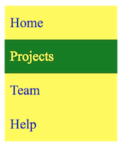

# Practice Problems: Lists - 9/14/2020

> Use Google Chrome for these practice problems to ensure that your browser results look the same as ours. Your code doesn't have to be identical to ours, but the output should be as close as possible.

We may use some new HTML and CSS in some of these problems. Be sure to look up unfamiliar tags and properties as you encounter them.

1. Using the "Raw Text" shown below, create a Web page that looks like the image pictured below it.

###### Raw Text

```
The Next Reckoning: Capitalism and Climate Change
By NATHANIEL RICH
The world’s most difficult problem has a solution so simple that it can be
expressed in four words: Stop burning greenhouse gases. How exactly to pull
this off is somewhat more complicated — just not as complicated as most
Americans have been led to believe.

Related articles
What Survival Looks Like After the Oceans Rise
How Big Business is Hedging Against the Apocalypse
Climate Chaos is Coming–and the Pinkertons Are Ready
```

###### How it should look in your browser:


### Solution

html body:

```html
<h1>The Next Reckoning: Capitalism and Climate Change</h1>

<p>By NATHANIEL RICH</p>

<p>
  The world’s most difficult problem has a solution so simple that it can be
  expressed in four words: Stop burning greenhouse gases. How exactly to pull
  this off is somewhat more complicated — just not as complicated as most
  Americans have been led to believe.
</p>

<h2>Related articles</h2>
<ul>
  <li>What Survival Looks Like After the Oceans Rise</li>
  <li>How Big Business is Hedging Against the Apocalypse</li>
  <li>Climate Chaos is Coming–and the Pinkertons Are Ready</li>
</ul>
```

#### Adjustments based on provided solution

The `h1` and first `p` element should be contained in a `header`:

```html
<header>
  <h1>The Next Reckoning: Capitalism and Climate Change</h1>
  <p>By NATHANIEL RICH</p>
</header>
```

---

2. Add CSS to your solution for the previous problem to remove the bullet character before each list item.

### Solution

```css
li {
  list-style-type: none;
}
```

#### Adjustments based on provided solution

Apply custom `list-style-type` to `ul`, not `li`:

```css
ul {
  list-style-type: none;
}
```

---

3. Using the "Raw Text" shown below, create a Web page that looks like the image pictured below it.

###### Raw Text

```
5 Reasons to Use jQuery
Open Source
Endless Tutorials
Huge Library
Cross-browser Compatibility
Large Variety of Plugins
```

###### How it should look in your browser:


### Solution

html body:

```html
<header>
  <h1>5 Reasons to Use jQuery</h1>
<header>

<ol>
  <li>Open Source</li>
  <li>Endless Tutorials</li>
  <li>Huge Library</li>
  <li>Cross-browser Compatibility</li>
  <li>Large Variety of Plugins</li>
</ol>
```

---

4. Add CSS to your solution for the previous problem to change the numbers from decimal to uppercase Roman digits (I, II, III, IV, V).

### Solution

```css
ol {
  list-style-type: upper-roman;
}
```

---

5. Update your solution from the previous problem to number the items in descending order (V, IV, III, II, I).

### Solution

```html
<ol reversed>
  <li>Open Source</li>
  <li>Endless Tutorials</li>
  <li>Huge Library</li>
  <li>Cross-browser Compatibility</li>
  <li>Large Variety of Plugins</li>
</ol>
```

---

6. Using the "Raw Text" shown below, create a Web page that looks like the image pictured below it.

###### Raw Text

```
HTML
Hypertext Markup Language, a standardized system for tagging text files to
achieve font, color, graphic, and hyperlink effects on World Wide Web pages.

Semantic
Relating to meaning in language or logic.

CSS
A style sheet language used for describing the presentation of a document
written in a markup language.
```

###### How it should look in your browser:


### Solution

html body:

```html
<dl>
  <dt>HTML</dt>
  <dd>
    Hypertext Markup Language, a standardized system for tagging text files to
    achieve font, color, graphic, and hyperlink effects on World Wide Web pages.
  </dd>
  <dt>Semantic</dt>
  <dd>
    Relating to meaning in language or logic.
  </dd>
  <dt>CSS</dt>
  <dd>
    A style sheet language used for describing the presentation of a document
    written in a markup language.
  </dd>
</dl>
```

---

7. The following code is an attempt to create a vertical navigation list on a web page:

```html
<nav>
  <ul>
    <li>Home</li>
    <li>Projects</li>
    <li>Team</li>
    <li>Help</li>
  </ul>
</nav>
```

```css
html {
  font-size: 20px;
}

nav ul {
  background-color: yellow;
  width: 200px;
}

nav li {
  color: blue;
}

nav a {
  box-sizing: border-box;
  line-height: 2.5;
  padding: 0 10px;
  text-decoration: none;
  width: 100%;
}
```

Modify the code to remove the bullets. Each item should be 10px from the left edge of the yellow box. When you point to any line in the menu, the browser should highlight the entire line inside the yellow box. The final result should look like this:



### Solution

```html
<!DOCTYPE html>
<html lang="en">
<head>
  <meta charset="utf-8" />
  <title>your page title goes here</title>

  <style>
    html {
      font-size: 20px;
    }

    nav ul {
      background-color: yellow;
      list-style-type: none;
      padding: 0;
      width: 200px;
    }

    nav li {
      color: blue;
    }

    nav a {
      box-sizing: border-box;
      display: inline-block;
      line-height: 2.5;
      padding: 0 10px;
      text-decoration: none;
      width: 100%;
    }

    nav a:hover,
    nav a:focus {
      background-color: green;
      color: yellow;
    }
  </style>
</head>

<body>
  <nav>
    <ul>
      <li><a href= "#">Home</a></li>
      <li><a href= "#">Projects</a></li>
      <li><a href= "#">Team</a></li>
      <li><a href= "#">Help</a></li>
    </ul>
  </nav>
</body>
</html>
```

8. Convert the solution from the last problem to a horizontal navigation bar that takes up the full width of the page. Again, try not to peek at the previous assignment. The final result should look like this:


### Solution

```html
<!DOCTYPE html>
<html lang="en">
<head>
  <meta charset="utf-8" />
  <title>your page title goes here</title>

  <style>
    html {
      font-size: 20px;
    }

    nav ul {
      background-color: yellow;
      list-style-type: none;
      padding: 0;
      width: 100%;
    }

    nav li {
      color: blue;
      display: inline-block;
      text-align: center;
      width: 25%;
    }

    nav a {
      box-sizing: border-box;
      display: inline-block;
      line-height: 2.5;
      padding: 0 10px;
      text-decoration: none;
      width: 100%;
    }

    nav a:hover,
    nav a:focus {
      background-color: green;
      color: yellow;
    }
  </style>
</head>

<body>
  <nav>
    <ul>
      <li><a href="#">Home</a></li><!--
      --><li><a href="#">Projects</a></li><!--
      --><li><a href="#">Team</a></li><!--
      --><li><a href="#">Help</a></li>
    </ul>
  </nav>
</body>
</html>
```
