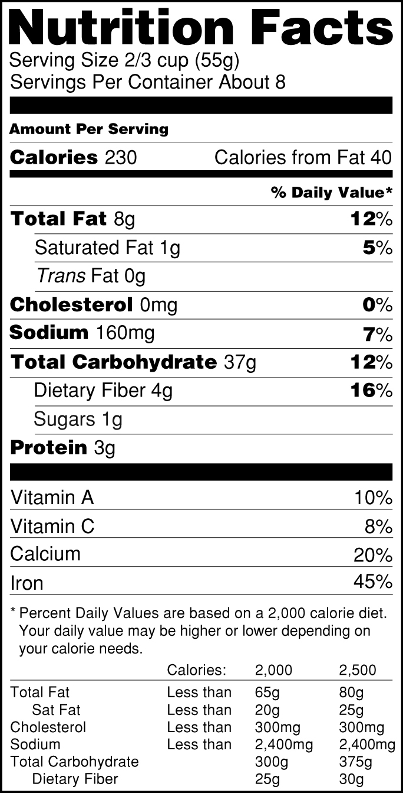

# On Your Own: Nutrition Facts Label - 9/22/2020

The project described in this assignment serves as a review of almost everything you've learned so far. While building it, you should expect to learn some new information on your own. Experienced developers often have to learn unfamiliar material while working on a project, and this project will exercise your ability to do that.

Some countries, including the USA, require nutrition facts labels on packaged food items. We'll use a version of the US nutrition label in this assignment.

While the US nutrition facts label looks simple, it packs a lot of information into a small space. It also uses a wide variety of styling, with horizontal rules of varying heights; a variety of font sizes and weights; indented content; and more. Creating the markup and styles for a web version of the label is more work than you may realize.

Your task for this project is to replicate the US-style label shown below (from Wikimedia). You should strive to make it look as much like the original as possible without purchasing fonts: your font stack can use Franklin Gothic Heavy for the main heading, and Helvetica Black and Helvetica for the remaining fonts. Keep in mind that not all systems supply these fonts, so add Arial to the list, and let the browser supply a default font if necessary.

The following label isn't the most current FDA (US Food and Drug Administration) design, but it's the design you should replicate.



You can see and use our [completed example here](https://d3jtzah944tvom.cloudfront.net/lesson_5/nutrition_facts_label/label.html).

Our CSS uses precisely one class, though the HTML applies it to more than one element. We use no other classes and no IDs at all. See how close you can get to this in your solution. The challenge of limiting class and id selectors will push you to find other ways to identify the elements you want to select. For instance, you may need to specify adjacent siblings, use pseudo-classes (e.g., `:first-of-type`), and use highly specific selectors to override existing styles. Read [the MDN pages on CSS Selectors](https://developer.mozilla.org/en-US/docs/Web/CSS/CSS_Selectors) before starting, and keep it handy as you work.

While coding, be mindful of semantics; avoid the `div` and `span` elements, and supply as much semantic information as you can. Our solution does not use `div` or `span` at all; try to match that.

There is more than one way to build this project. Our hints point you in the direction we took for our solution.

Compare your results against our completed solution.

This project is a good candidate for a code review. A code review is not mandatory, however. If you're happy with your code and your results, feel free to skip the code review. Otherwise, try to identify areas where you have questions or doubts, and direct our attention there; reviewing HTML and CSS line-by-line isn't feasible, so help us focus on areas where we can help.

> Hint 1: If you load our completed solution in your browser and load yours in another tab, you can toggle back and forth (shift-tab and control-shift-tab in most browsers) to see where the pages differ. This so-called **blink comparison** is useful when trying to replicate a design. We'll talk more about blink comparisons in a later lesson.

> Hint 2: Validate your HTML and CSS and test your code frequently. As your first big project, validation and testing are crucial.

> Hint 3: Use description lists to show nutrient names and quantities, e.g.,
>
> ```html
> <dl>
>   <dt>Total Fat</dt>
>   <dd>8g</dd>
> </dl>
> ```

> Hint 4: Bottom and top borders are useful for rendering horizontal lines.

> Hint 5: You can use a table to represent the content that shows nutrition data with the minimum percentages, and another table for the part below the "Percent Daily Values" explanation.

> Hint 6: Table cells can span multiple columns when you apply the 	colspan	 attribute to the `<td>` or `<th>` tag.

> Hint 7: Use a class selector to apply indentation to the indented lines.

> Hint 8: Use a 28px font as the document's root font; use 	rem	 units to define other fonts.

> Hint 9: Remember to use margins for spacing between elements, and padding for spacing within elements.

> Hint 10: Use the MDN documentation to find properties you didn't know existed.

> Hint 11: If you must, feel free to peek at our solution, but try to do so as a last resort.

### Solution

[nutrition_facts_label.html](nutrition_facts_label.html)

#### Adjustments based on provided solution

* Use the `sup` tag to superscript the last asterisk.
* A table can have multiple tbodies: the vitamins section can be another tbody and the percent daily values paragraph can be the footer.
* Indentation for percent daily value paragraph and indented columns in final table can be accomplished with `text-indent`.
