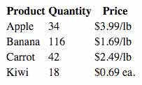
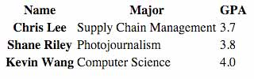
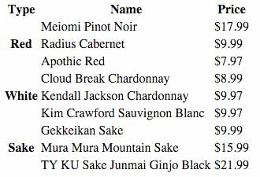

# Practice Problems: Tables - 9/21/2020

1. Create a table with column headings for "Product," "Quantity," and "Price." Fill the table with this data:

```
Apple, 34, $3.99/lb
Banana, 116, $1.69/lb
Carrot, 42, $2.49/lb
Kiwi, 18, $0.69 ea.
```

How it should look in the browser:



### Solution

```html
<table>
  <tr>
    <th>Product</th>
    <th>Quantity</th>
    <th>Price</th>
  </tr>

  <tr>
    <td>Apple</td>
    <td>34</td>
    <td>$3.99/lb</td>
  </tr>

  <tr>
    <td>Banana</td>
    <td>116</td>
    <td>$1.69/lb</td>
  </tr>

  <tr>
    <td>Carrot</td>
    <td>42</td>
    <td>$2.49/lb</td>
  </tr>

  <tr>
    <td>Kiwi</td>
    <td>18</td>
    <td>$0.69 ea.</td>
  </tr>
</table>
```

#### Adjustments based on provided solution

Put headings row in a `thead` and the rest of  the table in a `tbody`.

---

2. Update your solution to the previous problem to make the background color of the entire table cyan.

### Solution

```css
table {
  background-color: cyan;
}
```

---

3. Update your solution to the previous problem to make the background color of the individual data cells orange.

### Solution

```css
td {
  background-color: orange;
}
```

---

4. The background color of the table in the previous problem bleeds through as a border around the data cells. Update your solution to remove that border.

> Hint: You will need to read the MDN documentation for `<table>`.

### Solution

```css
table {
  background-color: cyan;
  border-spacing: 0;
}
```

#### Adjustments based on provided solution

`border-spacing` is unnecessary; just set `border-collapse: collapse;`.

---

5. Update your solution to the previous problem to change the background color for the Banana and Kiwi rows to yellow.

### Solution

> Hint: 
> Technique 1: Use classes. You will need to update both the HTML and the CSS.
> Technique 2: You can use a pseudo-class without updating the HTML.

```css
tbody tr:nth-child(even) td {
  background-color: yellow;
}
```

---

6. Create a table with both column and row headings. Use "Name," "Major," and "GPA" for the columns, and student names for the rows. Be sure to tell the browser which headings are for columns and which are for rows.

```
Chris Lee, Supply Chain Management, 3.7
Shane Riley, Photojournalism, 3.8
Kevin Wang, Computer Science, 4.0
```

How it should look in the browser:



### Solution

```html
<table>
  <thead>
    <tr>
      <th scope="col">Name</th>
      <th scope="col">Major</th>
      <th scope="col">GPA</th>
    </tr>
  </thead>
  <tbody>
    <tr>
      <th scope="row">Chris Lee</th>
      <td>Supply Chain Management</td>
      <td>3.7</td>
    </tr>
    <tr>
      <th scope="row">Shane Riley</th>
      <td>Photojournalism</td>
      <td>3.8</td>
    </tr>
    <tr>
      <th scope="row">Kevin Wang</th>
      <td>Computer Science</td>
      <td>4.0</td>
    </tr>
  </tbody>
</table>
```

---

7. Without adding anything to the HTML, update the solution to the previous problem to set the column headings to green, and the row headings to blue.

> Hint: You can select tags in CSS based on attribute values.

### Solution

```css
th[scope="col"] {
  color: green;
}

th[scope="row"] {
  color: blue;
}
```

---

8. For this table, our data has categories to create subsets of data within the same table. We need "Type," "Name," and "Price" column headings. Each row represents one of three different wine types. All rows that share a wine type should use the same row heading. Your result should look like the image below.

```
Red    Meiomi Pinot Noir             $17.99
       Radius Cabernet               $9.99
       Apothic Red                   $7.97
White  Cloud Break Chardonnay        $8.99
       Kendall Jackson Chardonnay    $9.97
       Kim Crawford Sauvignon Blanc  $9.97
Sake   Gekkeikan Sake                $9.99
       Mura Mura Mountain Sake       $15.99
       TY KU Sake Junmai Ginjo Black $21.99
```

How it should look in the browser:



> Hint: You will need the `rowspan` attribute to make each type value span three rows.

### Solution

```html
<table>
  <thead>
    <tr>
      <th scope="col">Type</th>
      <th scope="col">Name</th>
      <th scope="col">Price</th>
    </tr>
  </thead>
  <tbody>
    <tr>
      <th scope="row" rowspan="3">Red</th>
      <td>Meiomi Pinot Noir</td>
      <td>$17.99</td>
    </tr>
    <tr>
      <td>Radius Cabernet</td>
      <td>$9.99</td>
    </tr>
    <tr>
      <td>Apothic Red</td>
      <td>$7.97</td>
    </tr>

    <tr>
      <th scope="row" rowspan="3">White</th>
      <td>Cloud Break Chardonnay</td>
      <td>$8.99</td>
    </tr>
    <tr>
      <td>Kendall Jackson Chardonnay</td>
      <td>$9.97</td>
    </tr>
    <tr>
      <td>Kim Crawford Sauvignon Blanc</td>
      <td>$9.97</td>
    </tr>

    <tr>
      <th scope="row" rowspan="3">Sake</th>
      <td>Gekkeikan Sake</td>
      <td>$9.99</td>
    </tr>
    <tr>
      <td>Mura Mura Mountain Sake</td>
      <td>$15.99</td>
    </tr>
    <tr>
      <td>TY KU Sake Junmai Ginjo Black</td>
      <td>$21.99</td>
    </tr>
  </tbody>
</table>
```

---

9. It's difficult to tell which wines apply to each type in the output of the previous problem. Update your solution to display a 1-pixel wide gray border around all the table's cells and headings.

> Hint: Use the CSS property `border: 1px solid gray;`.

### Solution

```css
th, td {
  border: 1px solid gray;
}
```

#### Adjustments based on provided solution:

Use the previously seen `border-collapse` table property to make the border easier to look at:

```css
table {
  border-collapse: collapse;
}
```
