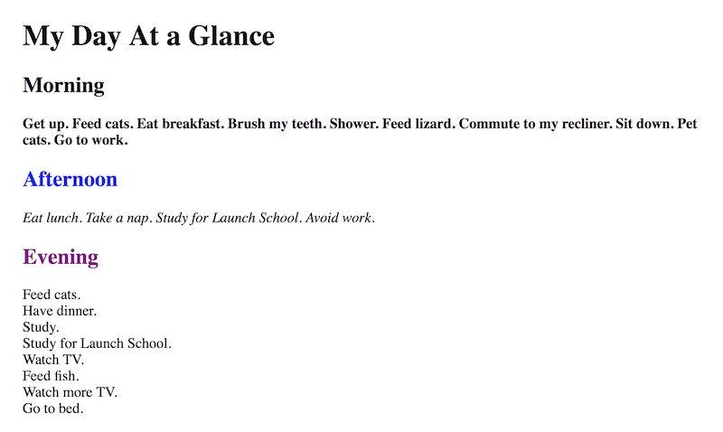

# On Your Own: Creating a Simple Page - 9/2/2020

For this project, you'll build a simple web page that describes your day.

You have the following HTML and CSS and text to begin this project.

```html
<h1>My Day At a Glance</h1>
<h2>Morning</h2>
<p>
  Get up. Feed cats. Eat breakfast. Brush my teeth. Shower. Feed lizard. Commute
  to my recliner. Sit down. Pet cats. Go to work.
</p>

<h2>Afternoon</h2>
<p>Eat lunch. Take a nap. Study for Launch School. Avoid work.</p>

<h2>Evening</h2>
<ul>
  Feed cats.
  Have dinner.
  Study.
  Study for Launch School.
  Watch TV.
  Feed fish.
  Watch more TV.
  Go to bed.
</ul>
```

```css
body {
  margin-left: 25px;
}

ul {
  padding-left: 0;
}
```

Modify your code so that your browser renders it as close as possible to the following image: 

Your project should meet the following requirements:

* For best results, set your browser to 600 pixels width and use the default fonts for your browser.
* Your browser/tab title should be `My Day at a Glance`.
* Display the Morning, Afternoon, and Evening items as black, blue, and purple text respectively.
* Display the Morning items with boldfaced text.
* Display the Afternoon items with italicized text.
* Display the Evening items without bullets or indentation.
* Include all required HTML elements, e.g., `<html>`, `<head>`, etc.
* Use the UTF-8 character set with English as the page language.
* Use HTML5.
* Pass both W3C HTML and CSS validators.

You may use the `style` element, but do not use the `style` *attribute*. Do not remove or alter the `body` or `ul` styles provided above.

Some of these items require that you modify the HTML; others want you to update the CSS. It's your choice for each. You may have to search the Internet (and MDN in particular) for assistance.

### Solution

[simple_page.html](simple_page.html)
