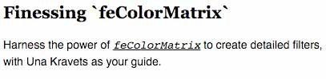
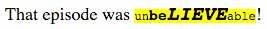

# Practice Problems: Text Formatting

These practice problems focus on HTML and CSS that deal with text, like the font family, style, color, and size.

1. Create an HTML page with a single paragraph of text. Write CSS to set the font size for most elements on the page to 20px (you may ignore headers, subscripts, and other items that often have a different size).

#### Solution

```html
<!DOCTYPE html>
<html lang="en">
<head>
  <meta charset="utf-8" />
  <title>Text Formatting</title>
  <style>
    body {
      font-size: 20px;
    }
  </style>
</head>
<body>
  <p>
  This is a single paragraph of text.
  </p>
</body>
</html>
```

---

2. Change the font family for the page from the previous problem to a sans-serif font.

#### Solution

```css
body {
  font-size: 20px;
  font-family: sans-serif;
}
```

---

3. Change the CSS for the previous problem to give the browser a choice one of three fonts (Tahoma, Trebuchet MS, Verdana), depending on what is available, before it uses the default sans-serif font.

#### Solution

```css
body {
  font-family: Tahoma, "Trebuchet MS", Verdana, sans-serif;
  font-size: 20px;
}
```

---

4. Change the text from the previous problem to italic.

#### Solution

```css
body {
  font-family: Tahoma, "Trebuchet MS", Verdana, sans-serif;
  font-size: 20px;
  text-decoration: italic;
}
```

#### Adjustments based on provided solution

`italic` is not a valid value for `text-decoration`; `text-decoration` is for adding lines over/under/through text. Use the `font-style` attribute instead:

```css
body {
  font-family: Tahoma, "Trebuchet MS", Verdana, sans-serif;
  font-size: 20px;
  font-style: italic;
}
```

---

5. Change the CSS from the previous problem to boldface (keep the italics).

#### Solution

```css
body {
  font-family: Tahoma, "Trebuchet MS", Verdana, sans-serif;
  font-size: 20px;
  font-style: italic;
  font-weight: bold;
}
```

---

6. Change the CSS from the previous problem to increase the line height to 2.5 times its default height.

#### Solution

```css
body {
  font-family: Tahoma, "Trebuchet MS", Verdana, sans-serif;
  font-size: 20px;
  font-style: italic;
  font-weight: bold;
  line-height: 2.5;
}
```

---

7. Change the CSS you wrote in questions 1-6 to a shorthand form that uses precisely one property. The output should not change.

#### Solution

```css
body {
  font: italic bold 20px/2.5 Tahoma, "Trebuchet MS", Verdana, sans-serif;
}
```

---

8. Change the CSS from the previous problem to right-align the text within the paragraph:

#### Solution

```css
body {
  font: italic bold 20px/2.5 Tahoma, "Trebuchet MS", Verdana, sans-serif;
  text-align: right;
}
```

---

9. Change the CSS from the previous problem to center-align the text within the paragraph:

#### Solution

```css
body {
  font: italic bold 20px/2.5 Tahoma, "Trebuchet MS", Verdana, sans-serif;
  text-align: center;
}
```

---

10. Change the CSS from the previous problem to fully justify the text within the paragraph:

#### Solution

```css
body {
  font: italic bold 20px/2.5 Tahoma, "Trebuchet MS", Verdana, sans-serif;
  text-align: justify;
}
```

---

11. Change the CSS from the previous problem to indent the start of the paragraph by 4em.

#### Solution

```css
body {
  font: italic bold 20px/2.5 Tahoma, "Trebuchet MS", Verdana, sans-serif;
  text-align: justify;
  text-indent: 4em;
}
```

---

12. Write the CSS needed to reproduce this screenshot: 

You should use this HTML:

```html
<article>
  <header>
    <h1>Finessing `feColorMatrix`</h1>
  </header>
  <p>
    Harness the power of <code>feColorMatrix</code> to create detailed
    filters, with Una Kravets as your guide.
  </p>
</article>
```

The `h1` heading uses the `Georgia` font while the `code` element uses the browser's default `monospace` font. The remaining text uses a 14px sans-serif font, with Helvetica and Arial preferred.

#### Solution

```css
body {
  font-family: Helvetica, Arial, sans-serif;
  font-size: 14px;
}

h1 {
  font-family: Georgia;
}

code {
  font-family: monospace;
  font-style: italic;
  text-decoration: underline;
}
```

---

13. Change the CSS from the previous problem to display the `h1` element text in blue, and the `code` text in green.

#### Solution

```css
body {
  font-family: Helvetica, Arial, sans-serif;
  font-size: 14px;
}

h1 {
  font-family: Georgia;
  color: blue;
}

code {
  font-family: monospace;
  font-style: italic;
  text-decoration: underline;
  color: green;
}
```

---

14. Write the CSS needed to reproduce this screenshot: 

You should use this HTML:

```html
<p>That episode was <mark>un<strong>be<em>lieve</em></strong>able</mark>!</p>
```

The font highlighted in yellow is `Courier`; use a backup font of `monospace`. The text uses four font sizes - `12px`, `15px`, `18px` and `20px`.

#### Solution

```css
p {
  font-family: serif;
  font-size: 20px;
}

mark {
  background-color: yellow;
  font-family: Courier, monospace;
  font-size: 12px;
}

strong {
  font-size: 15px;
}

em {
  font-size: 18px;
}
```

#### Adjustments based on provided solution

* `p` selector should be `body`.
* `body` doesn't need `font-family: serif`.
* `body` `font-size` is 18, not 20.
* `em` `font-size` is 20, not 18.
* `em` also needs `text-transform: uppercase;`.

---

15. Create some HTML with this paragraph:

```html
<p>
  The Creating Hyperlinks section of Getting to Know HTML discusses
  hyperlinks, or anchors. Be sure to work both "In Practice" sections; they
  pick up from where you left off in an earlier reading assignment.
</p>
```

Convert the text `Getting to Know HTML` to a hypertext link to this URL:

```
http://learn.shayhowe.com/html-css/getting-to-know-html/#creating-hyperlinks
```

The link should open in a new browser tab or window. Add CSS to remove the underline and change the color to red.

#### Solution

```html
<!DOCTYPE html>
<html lang="en">
<head>
  <meta charset="utf-8" />
  <title>your page title goes here</title>
  <style>
    a {
    text-decoration: none;
    color: red;
    }
  </style>
</head>

<body>
  <p>
    The Creating Hyperlinks section of 
    <a href="http://learn.shayhowe.com/html-css/getting-to-know-html/#creating-hyperlinks" target="_blank">
      Getting to Know HTML
    </a>
    discusses
    hyperlinks, or anchors. Be sure to work both "In Practice" sections; they
    pick up from where you left off in an earlier reading assignment.
  </p>
</body>
</html>
```

#### Adjustments based on provided solution

Attributes can be spread out across multiple lines if line length gets long, as with the anchor element above:
```html
<a href="http://learn.shayhowe.com/html-css/getting-to-know-html/#creating-hyperlinks"
   target="_blank">
```
