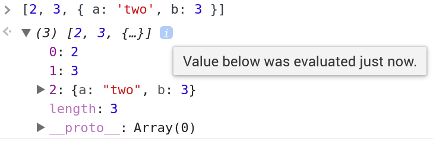

# JavaScript Language Fundamentals - Basics - 11/1/2020

1. Array Copy Part 1

Read through the code shown below. What does it log to the console at lines 6 and 10?

```javascript
let myArray = [1, 2, 3, 4];
const myOtherArray = myArray;

myArray.pop();
console.log(myArray);
console.log(myOtherArray);

myArray = [1, 2];
console.log(myArray);
console.log(myOtherArray);
```

### Solution

Lines 6 and 10 both log `[ 1, 2, 3 ]`.

---

2. Array Copy Part 2

In the previous exercise, the value of the reference gets copied. For this exercise, only the values of the array should be copied, but not the reference. Implement two alternative ways of doing this.

Here is the code from the previous exercise:

```javascript
let myArray = [1, 2, 3, 4];
const myOtherArray = myArray;

myArray.pop();
console.log(myOtherArray);

myArray = [1, 2];
console.log(myOtherArray);
```

### Solution

In order to copy the values of the array but not the reference, we can:

1. Push or assign the values individually into the new array:

```javascript
let myArray = [1, 2, 3, 4];
const myOtherArray = [];

myArray.forEach(num => myOtherArray.push(num));
```

2. Perform a shallow copy with `Array.prototype.slice()`:

```javascript
let myArray = [1, 2, 3, 4];
const myOtherArray = myArray.slice();
```

---

3. Array Concat Part 1

In this exercise, you will learn more about Arrays by implementing your own version of the `Array.prototype.concat` method. Write a function that returns a new array composed of all values from the first array argument and the second array or value argument. Take note of the following specifications when writing your `concat` function.

* The first argument will always be an array.
* The second argument can be either an array or another value.
* The function should return a new array.
* The elements in the new array should be in the same order as they appear in the arguments.
* The function should copy any object references from the arguments into the new array — i.e., if you make a change to a reference object from one of the arguments after calling `concat`, those changes should show up in the output array as well.
* The function should copy the values of primitives (e.g., strings, numbers, and booleans).

Examples:

```javascript
function concat(array1, secondArgument) {
  // ...
}

concat([1, 2, 3], [4, 5, 6]);          // [1, 2, 3, 4, 5, 6]
concat([1, 2], 3);                     // [1, 2, 3]
concat([2, 3], ['two', 'three']);      // [2, 3, "two", "three"]
concat([2, 3], 'four');                // [2, 3, "four"]


const obj = { a: 2, b: 3 };
const newArray = concat([2, 3], obj);
newArray;                              // [2, 3, { a: 2, b: 3 }]
obj.a = 'two';
newArray;                              // [2, 3, { a: "two", b: 3 }]

const arr1 = [1, 2, 3];
const arr2 = [4, 5, obj];
const arr3 = concat(arr1, arr2);
arr3;                                  // [1, 2, 3, 4, 5, { a: "two", b: 3 }]
obj.b = 'three';
arr3;                                  // [1, 2, 3, 4, 5, { a: "two", b: "three" }]

arr3[5].b = 3;                         // or, `arr3[5]['b'] = 3;`
obj;                                   // { a: "two", b: 3 }
```

> If you are using the Chrome DevTools console, it is important to be aware that the value of any array/object nested within another array/object will not be evaluated until after all code has been executed:
>
> 
>
> This can cause some of the objects in the test cases to appear as if they have been mutated before they really have been. If you experience this issue, just add another line (right after the line logging the array in question) to log the nested object directly:
>
> console.log(newArray);       // [2, 3, { a: "two", b: 3 }] -- displayed value
> console.log(newArray[2]);    // { a: 2, b: 3 }             -- actual value

### Solution

```javascript
function concat(array1, secondArgument) {
  let newArray = array1.slice();

  if(Array.isArray(secondArgument)) {
    secondArgument.forEach(element => newArray.push(element));
  } else {
    newArray.push(secondArugment);
  }

  return newArray;
}
```

---

4. Array Concat Part 2

The `concat` function from the previous exercise could only concatenate a maximum of two arrays. For this exercise, you are going to extend that functionality. Refactor the `concat` function to allow for the concatenation of two or more arrays or values.

Examples:

```javascript
concat([1, 2, 3], [4, 5, 6], [7, 8, 9]);    // [1, 2, 3, 4, 5, 6, 7, 8, 9]
concat([1, 2], 'a', ['one', 'two']);        // [1, 2, "a", "one", "two"]
concat([1, 2], ['three'], 4);               // [1, 2, "three", 4]
```

> Hint: You can use the rest parameter syntax to represent an indefinite number of arguments as an array.

### Solution

```javascript
function concat(array1, ...otherArguments) {
  let newArray = array1.slice();

  otherArguments.forEach(element => {
    if(Array.isArray(element)) {
      element.forEach(innerElement => newArray.push(innerElement));
    } else {
      newArray.push(element);
    }
  });

  return newArray;
}
```

---

5. Array Pop and Push

In this exercise, you will implement your own version of two Array methods: `Array.prototype.pop` and `Array.prototype.push`. The `pop` method removes the last element from an array and returns that element. If `pop` is called on an empty array, it returns `undefined`. The `push` method, on the other hand, adds one or more elements to the end of an array and returns the new `length` of the array.

Examples:

```javascript
// pop
const array1 = [1, 2, 3];
pop(array1);                        // 3
console.log(array1);                // [1, 2]
pop([]);                           // undefined
pop([1, 2, ['a', 'b', 'c']]);      // ["a", "b", "c"]

// push
const array2 = [1, 2, 3];
push(array2, 4, 5, 6);              // 6
console.log(array2);                // [1, 2, 3, 4, 5, 6]
push([1, 2], ['a', 'b']);          // 3
push([], 1);                       // 1
push([]);                          // 0
```

### Solution

```javascript
function pop(array) {
  let lastElement = array[array.length - 1];
  if (array.length > 0) array.length -= 1;
  return lastElement;
}

function push(array, value) {
  values.forEach(value => array[array.length] = value);
  return array.length;
}
```

---

6. Array and String Reverse

In this exercise, you will implement your own version of the `Array.prototype.reverse` method. Your implementation should differ from the built-in method in the following two ways:

* It should accept either a string or an array as an argument.
* It should return a new string or array.

Examples:

```javascript
function reverse(inputForReversal) {
  // ...
}

reverse('Hello');           // "olleH"
reverse('a');               // "a"
reverse([1, 2, 3, 4]);      // [4, 3, 2, 1]
reverse([]);                // []

const array = [1, 2, 3];
reverse(array);             // [3, 2, 1]
array;                      // [1, 2, 3]
```

### Solution

```javascript
function reverse(stringOrArray) {
  let result;

  if (typeof(stringOrArray) === 'string') {
    result = '';
  } else {
    result = [];
  }

  for (let index = stringOrArray.length - 1; index >= 0; index -= 1) {
    result = result.concat(stringOrArray[index]);
  }

  return result;
}
```

---

7. Array Shift and Unshift

In this exercise, you will implement your own versions of the `Array.prototype.shift` and `Array.prototype.unshift` methods. These methods manipulate the contents of an array starting from the first index.

The `shift` method removes the *first* element from an array and returns that element; if the array is empty, `shift` returns `undefined`. The `unshift` method *adds one or more* elements to the start of an array and returns the new `length` of the array. Both methods mutate the original array.

Examples:

```javascript
shift([1, 2, 3]);                // 1
shift([]);                       // undefined
shift([[1, 2, 3], 4, 5]);        // [1, 2, 3]

unshift([1, 2, 3], 5, 6);        // 5
unshift([1, 2, 3]);              // 3
unshift([4, 5], [1, 2, 3]);      // 3

const testArray = [1, 2, 3];
shift(testArray);                // 1
testArray;                       // [2, 3]
unshift(testArray, 5);           // 3
testArray;                       // [5, 2, 3]
```

### Solution

```javascript
function shift(array) {
  let firstElement = array[0];

  for (let index = 0; index < array.length; index += 1) {
    array[index] = array[index + 1];
  }

  if (array.length > 0) array.length -= 1;
  return firstElement;
}

function unshift(array, ...otherArguments) {
  let offset = otherArguments.length;
  array.length += offset;

  for (let index = array.length - 1; index >= offset; index -= 1) {
    array[index] = array[index - offset];
  }

  for (let index = 0; index < offset; index += 1) {
    array[index] = otherArguments[index];
  }

  return array.length;
}
```

---

8. Array Slice and Splice

In this exercise, you will implement your own versions of the `Array.prototype.slice` and `Array.prototype.splice` methods according to the following specifications.

The `slice` function takes three arguments: an `array`, and two integers representing a `begin` and an `end` index. The function returns a new array containing the extracted elements starting from `begin` up to but not including `end`. `slice` does not mutate the original array.

The `splice` function changes the contents of an array by deleting existing elements and/or adding new elements. The function takes the following arguments: an `array`, a `start` index, a `deleteCount`, and zero or more `elements` to be added. The function removes `deleteCount` number of elements from the array, beginning at the `start` index. If any optional `element` arguments are provided, `splice` inserts them into the array beginning at the `start` index. The function returns a new array containing the deleted elements, or an empty array (`[]`) if no elements are deleted. `splice` mutates the original array.

Additional specifications:

`slice`:

* The values of `begin` and `end` will always be integers greater than or equal to `0`.
* If the value of `begin` or `end` is greater than the length of the array, set it to equal the length.

`splice`:

* The values of `start` and `deleteCount` will always be integers greater than or equal to `0`.
* If the value of `start` is greater than the length of the array, set it to equal the length.
* If the value of `deleteCount` is greater than the number of elements from `start` up to the end of the array, set `deleteCount` to the difference between the array's length and `start`.
* Takes optional arguments for elements to add to the array; denoted by the parameters `element1` up to `elementN`. If no elements to add are provided, `splice` only removes elements from the array.

Examples:

```javascript
function slice(array, begin, end) {
  // ...
}

slice([1, 2, 3], 1, 2);               // [2]
slice([1, 2, 3], 2, 0);               // []
slice([1, 2, 3], 5, 1);               // []
slice([1, 2, 3], 0, 5);               // [1, 2, 3]

const arr1 = [1, 2, 3];
slice(arr1, 1, 3);                     // [2, 3]
arr1;                                  // [1, 2, 3]

function splice(array, start, deleteCount, element1, elementN) {
  // ...
}

splice([1, 2, 3], 1, 2);              // [2, 3]
splice([1, 2, 3], 1, 3);              // [2, 3]
splice([1, 2, 3], 1, 0);              // []
splice([1, 2, 3], 0, 1);              // [1]
splice([1, 2, 3], 1, 0, 'a');         // []

const arr2 = [1, 2, 3];
splice(arr2, 1, 1, 'two');             // [2]
arr2;                                  // [1, "two", 3]

const arr3 = [1, 2, 3];
splice(arr3, 1, 2, 'two', 'three');    // [2, 3]
arr3;                                  // [1, "two", "three"]

const arr4 = [1, 2, 3];
splice(arr4, 1, 0);                    // []
splice(arr4, 1, 0, 'a');               // []
arr4;                                  // [1, "a", 2, 3]

const arr5 = [1, 2, 3];
splice(arr5, 0, 0, 'a');               // []
arr5;                                  // ["a", 1, 2, 3]
```

### Solution

```javascript
function slice(array, begin, end) {
  if (begin > array.length) begin = array.length;
  if (end > array.length) end = array.length;

  let result = [];
  for (let index = begin; index < end; index += 1) {
    result.push(array[index]);
  }

  return result;
}

function splice(array, start, deleteCount, ...otherArgs) {
  if (start > array.length) start = array.length;
  if (deleteCount > array.length - start) deleteCount = array.length - start;

  // delete the specified count from array, beginning at start index
  let deletedElements = [];
  for (let index = start; index < start + deleteCount; index += 1) {
    deletedElements.push(array[index]);
    array[index] = array[index + deleteCount];
  }
  if (array.length > 0) array.length -= deleteCount;

  // make space for new elements by right-shifting everything in array
  // beginning at start index
  array.length += otherArgs.length;
  for (let index = array.length - 1; index >= start; index -= 1) {
    array[index] = array[index - otherArgs.length];
  }

  // insert the new elements
  for (let index = 0; index < otherArgs.length; index += 1) {
    array[index + start] = otherArgs[index];
  }

  return deletedElements;
}
```

---

9. Oddities

The `oddities` function takes an array as an argument and returns a new array containing every other element from the input array. The values in the returned array are the first (index `0`), third, fifth, and so on, elements of the input array. The program below uses the array returned by `oddities` as part of a comparison. Can you explain the results of these comparisons?

Examples:

```javascript
function oddities(array) {
  const oddElements = [];

  for (let i = 0; i < array.length; i += 2) {
    oddElements.push(array[i]);
  }

  return oddElements;
}

oddities([2, 3, 4, 5, 6]) === [2, 4, 6];      // false
oddities(['abc', 'def']) === ['abc'];         // false
```

### Solution

The equality operator considers two arrays to be equal if they are the *same* array. Simply containing the same values is not enough.

---

10. Array Comparison

The array comparison function that we implemented in the [Arrays lesson](https://launchschool.com/lessons/e15c92bb/assignments/a52dfe90) ([Alternate link](https://launchschool.com/lessons/e2c71a47/assignments/91e2c5cf) if the previous link doesn't work) implicitly assumed that when comparing two arrays, any matching values must also have matching index positions. The objective of this exercise is to reimplement the function so that two arrays containing the same values—but in a different order—are considered equal. For example, [1, 2, 3] === [3, 2, 1] should return true.

Examples:

```javascript
function areArraysEqual(array1, array2) {
  // ...
}

areArraysEqual([1, 2, 3], [1, 2, 3]);                  // true
areArraysEqual([1, 2, 3], [3, 2, 1]);                  // true
areArraysEqual(['a', 'b', 'c'], ['b', 'c', 'a']);      // true
areArraysEqual(['1', 2, 3], [1, 2, 3]);                // false
areArraysEqual([1, 1, 2, 3], [3, 1, 2, 1]);            // true
areArraysEqual([1, 2, 3, 4], [1, 1, 2, 3]);            // false
areArraysEqual([1, 1, 2, 2], [4, 2, 3, 1]);            // false
areArraysEqual([1, 1, 2], [1, 2, 2]);                  // false
areArraysEqual([1, 1, 1], [1, 1]);                     // false
areArraysEqual([1, 1], [1, 1]);                        // true
```

### Solution

```javascript
function areArraysEqual(array1, array2) {
  if (array1.length !== array2.length) return false;

  let array2Copy = array2.slice();
  for (let index = 0; index < array1.length; index += 1) {
    let element = array1[index];
    let indexOfElement = array2Copy.indexOf(element);
    if (indexOfElement === -1) return false;

    array2Copy.splice(indexOfElement, 1);
  }

  return true;
}
```
