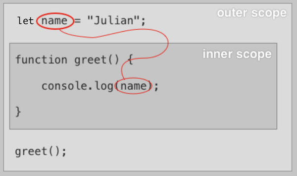
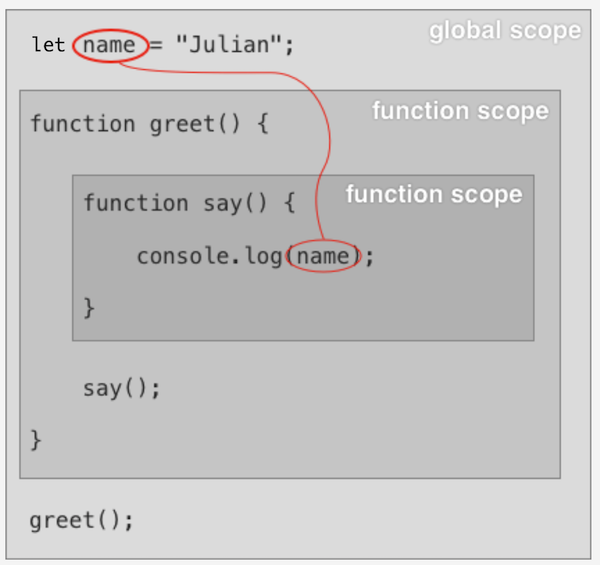
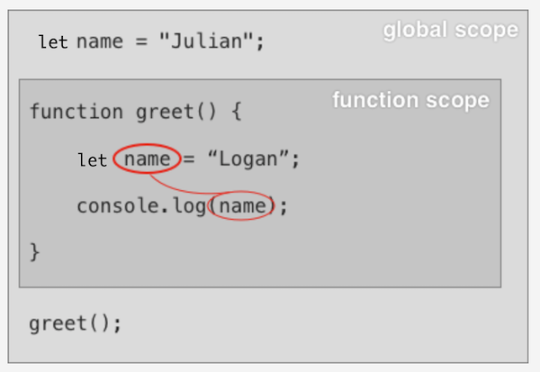

# Functional Scopes and Lexical Scoping - 10/23/2020

A variable's scope is the part of the program that can access that variable by name; this is true in all programming languages. Specifically, variable scoping rules describe how and where the language finds and retrieves values from previously declared variables. In JavaScript, every function or block creates a new variable scope.

## The Global Scope

Very small JavaScript programs with no functions or blocks exist entirely within a single scope called the global scope:

```javascript
let name = 'Julian';
console.log(name);
```

## Function Scope

```javascript
let name = 'Julian';

function greet() {
  let myName = name;
  console.log(myName);
}

greet(); // => Julian
```

No we have two scopes: 1) the global scope and 2) the scope from the declaration of the `greet` function. `name` and `greet` are in the global scope, while `myName` is in the **local scope** of `greet`. Within the `greet` function, we can access the `name` variable since the code within a function can access all variables in all surrounding scopes. However, `myName` is only available inside of `greet`: variables declared inside a scope have function scope, and they cannot be accessed outside the body of the function.

You can think of variable scopes visually; function scopes nest inside each other. The code within an inner scope can access any variables in the same scope or *any surrounding scope*.



This works no matter how deeply nested a function is. Consider the following example: `say` can access the `name` variable even though `say` is nested inside `greet`, and `greet` is nested in the outermost scope.

```javascript
let name = 'Julian';

function greet() {
  function say() {
    console.log(name);
  }

  say();
}
```



## Block Scope

Let's add a block to the picture with a `while` loop:

```javascript
let name = 'Julian';        // `name` is in the global scope

function greet() {          // `greet` is also in the global scope
  let counter = 0;          // `counter` is in the function scope
  while (counter < 3) {
    let myName = name;      // `myName` is in the block scope
    console.log(myName);
    counter += 1;
  }

  // console.log(myName);   // would raise an error (`myName` not in scope)
  console.log(counter);
}

greet();                    // => Julian (3 times)
// console.log(myName);     // would raise an error (`myName` not in scope)
// console.log(counter);    // would raise an error (`counter` not in scope)
```

We now have three scopes:

1. the global scope (which includes `name` and `greet`)
2. the function scope (which includes `counter`)
3. the block scope (which includes `myName`)

Both function and block scopes are also called local scopes.

## Lexical Scoping

JavaScript uses **Lexical Scoping** to resolve variables: it uses the structure of the source code to determine the variable's scope. That is, *the source code defines the scope*. This means that when you write a function in your code, it creates a scope even if the function never gets executed and has no variables of its own. At any point in a JavaScript program, there is a hierarchy of scopes from the local scope of the code up to the program's global scope.

When JavaScript tries to find a variable, it searches this hierarchy from the bottom to the top. It stops and returns the first variable it finds with a matching name. This means that variables in a lower scope can *shadow*, or hide, a variable with the same name in a higher scope.

Most mainstream programming languages use lexical scoping rules (also called "static scoping".) Some languages use "dynamic scoping" instead or make dynamic scoping a choice. We won't get into dynamic scoping here.

## Adding Variables to the Current Scope

There are a number of ways to create a variable in the current scope:

* use the `let` or `const` keywords
* use the `var` keyword, which we'll discuss shortly
* define parameters for a function - each parameter is a local variable.
* A function declaration creates a variable with the same name as the function. We'll talk about this in the next lesson.
* A class declaration also creates a variable with the same name as the class. We'll talk about this in a later course.

```javascript
function lunch() {     // a function declaration creates a new variable scope
  let food = 'taco';   // 1. add a new variable within the current scope
}

function eat(food) {   // 2. parameters create variables during function invocation
  console.log('I am eating ' + food);
}

function drink() {     // 3. add a new variable `drink` within the global scope
  console.log('I am drinking a glass of water.');
}
```

## Variable Assignment

Variable scoping rules apply equally to both assignment and referencing:

```javascript
country = 'Liechstenstein';
```

This code checks the current scope and then each higher scope, looking for a variable with the name `country`. JavaScript sets the first `country` variable it finds to `"Liechtenstein"`.

```javascript
let country = 'Spain';
function update() {
  country = 'Liechtenstein';
}

console.log(country);   // logs: Spain

update();
console.log(country);   // logs: Liechtenstein
```

If JavaScript can't find a matching variable, *it creates a new global variable instead*. This is almost never what you want and can be the source of subtle bugs.

```javascript
// no other code above
function assign() {
  let country1 = 'Liechtenstein';
  country2 = 'Spain';
}

assign();
console.log(country2);   // logs: Spain
console.log(country1);   // raises `ReferenceError: country1 is not defined`
// no other code below
```

## Variable Shadowing

```javascript
let name = 'Julian';

function greet() {
  let name = 'Logan';
  console.log(name);
}

greet();   // logs: Logan
```

The variable declaration for `name` in the `greet` function shadows the outer `name` variable on line 1. Because of this, within `greet`, you can only access the inner `name` variable on line 4.



If JavaScript can't find a referenced variable anywhere in the scope hierarchy, it throws a `ReferenceError`:

```javascript
state;   // raises `ReferenceError: state is not defined`
```

> Remember these important variable scoping rules:
>
> * every function declaration creates a new local variable scope
> * every block creates a new local variable scope
> * lexical scope uses the structure of the source code to determine a variable's scope - the code doesn't have to be executed for the scope to exist
> * all variables in the same or surrounding scopes are visible inside functions and blocks
