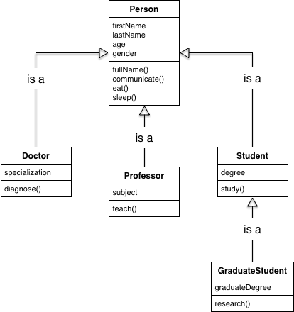
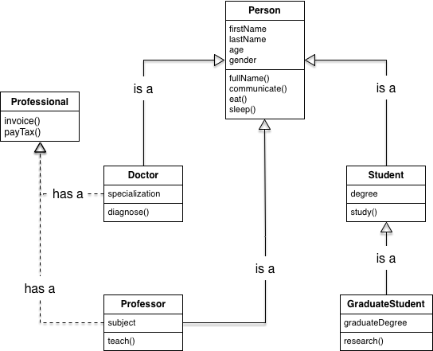

# JS225 Exercises: Object Creation Patterns - 2/1/2021

## 1. Ancestors

Implement an `ancestors` method that returns the prototype chain (ancestors) of a calling object as an array of object names. Here's an example output:

```javascript
// name property added to make objects easier to identify
const foo = {name: 'foo'};
const bar = Object.create(foo);
bar.name = 'bar';
const baz = Object.create(bar);
baz.name = 'baz';
const qux = Object.create(baz);
qux.name = 'qux';

qux.ancestors();  // returns ['baz', 'bar', 'foo', 'Object.prototype']
baz.ancestors();  // returns ['bar', 'foo', 'Object.prototype']
bar.ancestors();  // returns ['foo', 'Object.prototype']
foo.ancestors();  // returns ['Object.prototype']
```

### Solution

```javascript
Object.prototype.ancestors = function() {
  let protos = [];
  let ancestor = Object.getPrototypeOf(this);

  while (ancestor.hasOwnProperty('name')) {
    protos.push(ancestor.name);
    ancestor = Object.getPrototypeOf(ancestor);
  }

  if (ancestor === Object.prototype) protos.push('Object.prototype');

  return protos;
}
```

---

## 2. Delegate

Write a `delegate` function that can be used to delegate the behavior of a method or function to another object's method. `delegate` takes a minimum of two arguments: (1) the object and (2) name of the method on the object. The remaining arguments, if any, are passed — as arguments — to the objects' method that it delegates to.

> Note that this is not the same as using `bind`. `bind` returns a new function, whereas `delegate` maintains the reference.

Here's a sample run:

```javascript
const foo = {
  name: 'test',
  bar(greeting) {
    console.log(`${greeting} ${this.name}`);
  },
};

const baz = {
  qux: delegate(foo, 'bar', 'hello'),
};

baz.qux();   // logs 'hello test';

foo.bar = () => { console.log('changed'); };

baz.qux();          // logs 'changed'
```

### Solution

If we can't use `bind`, we can create a new object inheriting from `delegate`'s first argument (the object to which we're delegating) and return a function that, when invoked, invokes this method on the subclass, causing it to proceed up the prootype chain to find the method on the delegated object.

```javascript
function delegate(obj, method, ...args) {
  let delegator = Object.create(obj);
  return function() {
    delegator[method](...args);
  };
}
```

#### Adjustments based on provided solution

I was overthinking this. The statement about `delegate` maintaining the reference just means the necessary variables (object, method, and arguments) need to be accessible within the closure of the function that `delegate` returns. The provided solution makes this even cleaner with an arrow function:

```javascript
function delegate(obj, method, ...args) {
  return () => obj[method](...args);
}
```

---

## 3. Classical Object Creation

Implement the following diagram using the pseudo-classical approach. Subclasses should inherit everything from the superclass and not just the methods. Reuse the constructors of the superclass when implementing a subclass.

> Hint: Revisit this article on [inheritance on MDN](https://developer.mozilla.org/en-US/docs/Learn/JavaScript/Objects/Inheritance) for an idea on how to reuse the constructor of the superclass when implementing a subclass and inherit not just the methods.



> For the methods, you can have it log out anything you want.

Here's a sample run you can use as a reference:

```javascript
const person = new Person('foo', 'bar', 21, 'gender');
console.log(person instanceof Person);     // logs true
person.eat();                              // logs 'Eating'
person.communicate();                      // logs 'Communicating'
person.sleep();                            // logs 'Sleeping'
console.log(person.fullName());            // logs 'foo bar'

const doctor = new Doctor('foo', 'bar', 21, 'gender', 'Pediatrics');
console.log(doctor instanceof Person);     // logs true
console.log(doctor instanceof Doctor);     // logs true
doctor.eat();                              // logs 'Eating'
doctor.communicate();                      // logs 'Communicating'
doctor.sleep();                            // logs 'Sleeping'
console.log(doctor.fullName());            // logs 'foo bar'
doctor.diagnose();                         // logs 'Diagnosing'

const graduateStudent = new GraduateStudent('foo', 'bar', 21, 'gender', 'BS Industrial Engineering', 'MS Industrial Engineering');
// logs true for next three statements
console.log(graduateStudent instanceof Person);
console.log(graduateStudent instanceof Student);
console.log(graduateStudent instanceof GraduateStudent);
graduateStudent.eat();                     // logs 'Eating'
graduateStudent.communicate();             // logs 'Communicating'
graduateStudent.sleep();                   // logs 'Sleeping'
console.log(graduateStudent.fullName());   // logs 'foo bar'
graduateStudent.study();                   // logs 'Studying'
graduateStudent.research();                // logs 'Researching'
```

### Solution

```javascript
function Person(firstName, lastName, age, gender) {
  this.firstName = firstName;
  this.lastName = lastName;
  this.age = age;
  this.gender = gender;
}

Person.prototype.fullName = function() {
  return `${this.firstName} ${this.lastName}`.trim();
};

Person.prototype.communicate = function() {
  console.log('Communicating');
};

Person.prototype.eat = function() {
  console.log('Eating');
};

Person.prototype.sleep = function() {
  console.log('Sleeping');
};

function Doctor(firstName, lastName, age, gender, specialization) {
  Person.call(this, firstName, lastName, age, gender);
  this.specialization = specialization;
}

Doctor.prototype = Object.create(Person.prototype);
Doctor.prototype.constructor = Doctor;

Doctor.prototype.diagnose = function() {
  console.log('Diagnosing');
};

function Professor(firstName, lastName, age, gender, subject) {
  Person.call(this, firstName, lastName, age, gender);
  this.subject = subject;
}

Professor.prototype = Object.create(Person.prototype);
Professor.prototype.constructor = Professor;

Professor.prototype.teach = function() {
  console.log('Teaching');
};

function Student(firstName, lastName, age, gender, degree) {
  Person.call(this, firstName, lastName, age, gender);
  this.degree = degree;
}

Student.prototype = Object.create(Person.prototype);
Student.prototype.constructor = Student;

Student.prototype.study = function() {
  console.log('Studying');
};

function GraduateStudent(firstName, lastName, age, gender, degree, graduateDegree) {
  Student.call(this, firstName, lastName, age, gender, degree);
  this.graduateDegree = graduateDegree;
}

GraduateStudent.prototype = Object.create(Student.prototype);
GraduateStudent.prototype.constructor = GraduateStudent;

GraduateStudent.prototype.research = function() {
  console.log('Researching');
};
```

#### Further Exploration

Refactor the solution to use ES6 `class` syntax.

```javascript
class Person {
  constructor(firstName, lastName, age, gender) {
    this.firstName = firstName;
    this.lastName = lastName;
    this.age = age;
    this.gender = gender;
  }

  fullName() {
    return `${this.firstName} ${this.lastName}`.trim();
  }

  communicate() {
    console.log('Communicating');
  }

  eat() {
    console.log('Eating');
  }

  sleep() {
    console.log('Sleeping');
  }
}

class Doctor extends Person {
  constructor(firstName, lastName, age, gender, specialization) {
    super(firstName, lastName, age, gender);
    this.specialization = specialization;
  }

  diagnose() {
    console.log('Diagnosing');
  }
}

class Professor extends Person {
  constructor(firstName, lastName, age, gender, subject) {
    super(firstName, lastName, age, gender);
    this.subject = subject;
  }

  teach() {
    console.log('Teaching');
  }
}

class Student extends Person {
  constructor(firstName, lastName, age, gender, degree) {
    super(firstName, lastName, age, gender);
    this.degree = degree;
  }

  study() {
    console.log('Studying');
  }
}

class GraduateStudent extends Student {
  constructor(firstName, lastName, age, gender, degree, graduateDegree) {
    super(firstName, lastName, age, gender, degree);
    this.graduateDegree = graduateDegree;
  }

  research() {
    console.log('Researching');
  };
}
```

---

## 4. Classical Object Creation with Mixin

In this exercise, you'll make an `extend` function and use it to add a mixin to the previous exercise. The mixin adds `invoice` and `payTax` methods.



Check out the example run and note how the `Professional` mixin is applied to the `Doctor` and `Professor` constructors via `extend`:

```javascript
const doctor = extend(new Doctor('foo', 'bar', 21, 'gender', 'Pediatrics'), Professional);
console.log(doctor instanceof Person);     // logs true
console.log(doctor instanceof Doctor);     // logs true
doctor.eat();                              // logs 'Eating'
doctor.communicate();                      // logs 'Communicating'
doctor.sleep();                            // logs 'Sleeping'
console.log(doctor.fullName());            // logs 'foo bar'S
doctor.diagnose();                         // logs 'Diagnosing'

const professor = extend(new Professor('foo', 'bar', 21, 'gender', 'Systems Engineering'), Professional);
console.log(professor instanceof Person);     // logs true
console.log(professor instanceof Professor);  // logs true
professor.eat();                              // logs 'Eating'
professor.communicate();                      // logs 'Communicating'
professor.sleep();                            // logs 'Sleeping'
console.log(professor.fullName());            // logs 'foo bar'
professor.teach();                            // logs 'Teaching'

doctor.invoice();                          // logs 'foo bar is Billing customer'
doctor.payTax();                           // logs 'foo bar Paying taxes'

Professional.invoice = function() {
  console.log(`${this.fullName()} is Asking customer to pay`);
};

doctor.invoice();                          // logs 'foo bar is Asking customer to pay'
professor.invoice();                       // logs 'foo bar is Asking customer to pay'
professor.payTax();                        // logs 'foo bar Paying taxes'
```

### Solution

```javascript
function extend(instance, mixin) {
  Object.keys(mixin).forEach(function(prop) {
    instance[prop] = () => mixin[prop].call(instance);
  });

  return instance;
}

const Professional = {
  invoice() {
    console.log(`${this.fullName()} is Billing customer`);
  },
  payTax() {
    console.log(`${this.fullName()} is Paying taxes`);
  },
}
```

---

## 5. Anonymizer

Using OLOO create an `Account` prototype object that anonymizes user objects on `init`. The created object should not have access to the function that anonymizes a user other than through the `init` and `reanonymize` methods. The function that anonymizes creates a 16 character sequence composed of letters and numbers. The following are the properties and methods on the `Account` object:

* `init`: The `init` method sets the `email`, `password`, `firstName`, `lastName`, and `displayName` of user. The `displayName` is a 16 character sequence generated for the user. It's used as the display name of a user.
* `reanonymize`: This method generates a new 16 character sequence and reassigns it to the `displayName` property if the password provided is valid. Returns `true` if successfully re-anonymized. Returns `'Invalid Password'` if the password provided is not valid.
* `resetPassword`: This method asks the user for a new password and reassigns it to the `password` property. To reset the password, the user must provide the current password. Returns `'Invalid Password'` if the password provided is not valid. Returns `true` if the password is successfully reset.
* `firstName`: This method returns the first name of the user if the password provided is valid. Returns `'Invalid Password'` if the password provided is not valid.
* `lastName`: This method returns the last name of the user if the password provided is valid. Returns `'Invalid Password'` if the password provided is not valid.
* `email`: This method returns the email name of the user if the password provided is valid. Returns `'Invalid Password'` if the password provided is not valid.
* `displayName`: This property returns the `displayName` — the 16 character sequence.

Other than the above properties, methods, and properties inherited from `Object.prototype`, no other method or property should exist on the object returned by the `Account` prototype object.

Here's a sample for your reference:

```javascript
const fooBar = Object.create(Account).init('foo@bar.com', '123456', 'foo', 'bar');
console.log(fooBar.firstName);                     // returns the firstName function
console.log(fooBar.email);                         // returns the email function
console.log(fooBar.firstName('123456'));           // logs 'foo'
console.log(fooBar.firstName('abc'));              // logs 'Invalid Password'
console.log(fooBar.displayName);                   // logs 16 character sequence
console.log(fooBar.resetPassword('123', 'abc'))    // logs 'Invalid Password';
console.log(fooBar.resetPassword('123456', 'abc')) // logs true

const displayName = fooBar.displayName;
fooBar.reanonymize('abc');                         // returns true
console.log(displayName === fooBar.displayName);   // logs false
```

### Solution

```javascript
const Account = (function() {
  const self = {
    email: '',
    password: '',
    firstName: '',
    lastName: '',
  };

  function anonymize() {
    const MIN_CHAR_CODE = '0'.charCodeAt(0);
    const MAX_CHAR_CODE = 'z'.charCodeAt(0);
    const LENGTH = 16;

    const getRandomChar = function() {
      const min = MIN_CHAR_CODE;
      const max = MAX_CHAR_CODE;
      let code = Math.floor(Math.random() * (max - min + 1) + min);
      return String.fromCharCode(code);
    };

    let sequence = '';
    for (let counter = 1; counter <= LENGTH; counter += 1) {
      sequence += getRandomChar();
    }

    return sequence;
  }

  return {
    init(email, password, firstName, lastName) {
      self.email = email;
      self.password = password;
      self.firstName = firstName;
      self.lastName = lastName;
      this.displayName = anonymize();

      return this;
    },

    reanonymize(password) {
      if (self.password !== password) return 'Invalid Password';
      this.displayName = anonymize();
      return true;
    },

    resetPassword(currentPassword, newPassword) {
      if (self.password !== currentPassword) return 'Invalid Password';
      self.password = newPassword;
      return true;
    },

    firstName(password) {
      if (self.password !== password) return 'Invalid Password';
      return self.firstName;
    },

    lastName(password) {
      if (self.password !== password) return 'Invalid Password';
      return self.lastName;
    },

    email(password) {
      if (self.password !== password) return 'Invalid Password';
      return self.email;
    },
  };
})();
```

#### Further Exploration

This solution works but it only works for one set of private data. Here's an extended version of the example run:

```javascript
const fooBar = Object.create(Account).init('foo@bar.com', '123456', 'foo', 'bar');
console.log(fooBar.firstName);                     // returns the firstName function
console.log(fooBar.email);                         // returns the email function
console.log(fooBar.firstName('123456'));           // logs 'foo'
console.log(fooBar.firstName('abc'));              // logs 'Invalid Password'
console.log(fooBar.displayName);                   // logs 16 character sequence
console.log(fooBar.resetPassword('123', 'abc'))    // logs 'Invalid Password';
console.log(fooBar.resetPassword('123456', 'abc')) // logs true

const displayName = fooBar.displayName;
fooBar.reanonymize('abc');                         // returns true
console.log(displayName === fooBar.displayName);   // logs false

const bazQux = Object.create(Account).init('baz@qux.com', '123456', 'baz', 'qux');
console.log(fooBar.firstName('abc'));              // logs 'baz' but should log foo.
console.log(fooBar.email('abc'));                  // 'baz@qux.com' but should 'foo@bar.com'
```

Modify the solution so that it can accommodate creating multiple objects with their own private data.

##### FE Solution

I was not able to figure this out on my own. This is a reimplementation after glancing at Genie Guo's solution: the `init` method sets state to local variables (local to `init` instead of local to `Account`); all methods are also set inside `init` instead of literal object properties.

```javascript
const Account = (function() {
  function anonymize() {
    const MIN_CHAR_CODE = '0'.charCodeAt(0);
    const MAX_CHAR_CODE = 'z'.charCodeAt(0);
    const LENGTH = 16;

    const getRandomChar = function() {
      const min = MIN_CHAR_CODE;
      const max = MAX_CHAR_CODE;
      let code = Math.floor(Math.random() * (max - min + 1) + min);
      return String.fromCharCode(code);
    };

    let sequence = '';
    for (let counter = 1; counter <= LENGTH; counter += 1) {
      sequence += getRandomChar();
    }

    return sequence;
  }

  return {
    init(email, password, firstName, lastName) {
      let self = {
        email,
        password,
        firstName,
        lastName,
      };

      this.displayName = anonymize();

      this.reanonymize = function reanonymize(password) {
        if (self.password !== password) return 'Invalid Password';
        this.displayName = anonymize();
        return true;
      };

      this.resetPassword = function resetPassword(currentPassword, newPassword) {
        if (self.password !== currentPassword) return 'Invalid Password';
        self.password = newPassword;
        return true;
      };

      this.firstName = function firstName(password) {
        if (self.password !== password) return 'Invalid Password';
        return self.firstName;
      };

      this.lastName = function lastName(password) {
        if (self.password !== password) return 'Invalid Password';
        return self.lastName;
      };

      this.email = function email(password) {
        if (self.password !== password) return 'Invalid Password';
        return self.email;
      };

      return this;
    },
  };
})();
```

---

## 6. Mini Inventory Management System

In this exercise, you'll build a simple inventory management system. The system is composed of an item creator, an items manager, and a reports manager. The item creator makes sure that all necessary information are present and valid. The item manager is responsible for creating items, updating information about items, deleting items, and querying information about the items. Finally, the report manager generates reports for a specific item or ALL items. Reports for specific items are generated from report objects created from the report manager. The report manager is responsible for reports for all items.

### Component Specifications

Here's all the required information for an item:

1. **SKU code**: This is the unique identifier for a product. It consists of the first 3 letters of the item and the first 2 letters of the category. If the item name consists of two words and the first word consists of two letters only, the next letter is taken from the next word.
2. **Item name**: This is the name of the item. It must consist of a minimum of 5 characters. Spaces are not counted as characters.
3. **Category**: This is the category that the item belongs to. It must consist of a minimum of 5 characters and be only one word.
4. **Quantity**: This is the quantity in stock of an item. This must not be blank. You may assume that a valid number will be provided.

The following are the methods that the items manager can perform:

1. `create`: This method creates a new item. Returns false if creation is not successful.
2. `update`: This method accepts an SKU Code and an object as an argument and updates any of the information on an item. You may assume valid values will be provided.
3. `delete`: This method accepts an SKU Code and deletes the item from the list. You may assume a valid SKU code is provided.
4. `items`: This property returns all the items.
5. `inStock`: This method lists all the items that have a quantity greater than `0`.
6. `itemsInCategory`: This method lists all the items for a given category

The following are the methods on the reports managers:

1. `init`: This method accepts the `ItemManager` object as an argument and assigns it to the `items` property.
2. `createReporter`: This method accepts an SKU code as an argument and returns an object.
  * The returned object has one method, `itemInfo`. It logs to the console all the properties of an object as "key:value" pairs (one pair per line). There are no other properties or methods on the returned object (except for properties/methods inherited from `Object.prototype`).
3. `reportInStock`: Logs to the console the item names of all the items that are in stock as a comma separated values.

> Notes:
> 
> * There's no need to add the ability to validate the uniqueness of the SKU code. Given the current description, it's possible that a duplicate will exist.
> * Each required piece of information for an item corresponds to one property.
> * If any of the require information provided is not valid, the item creator returns an object with a notValid property with a value of true.
> * The created item objects should not have any methods/properties on them other than the required information above and those inherited from Object.prototype.
> * You may add methods to the item manager as you deem necessary.

Here is a sample run that you can use a reference:

```javascript
ItemManager.create('basket ball', 'sports', 0);           // valid item
ItemManager.create('asd', 'sports', 0);
ItemManager.create('soccer ball', 'sports', 5);           // valid item
ItemManager.create('football', 'sports');
ItemManager.create('football', 'sports', 3);              // valid item
ItemManager.create('kitchen pot', 'cooking items', 0);
ItemManager.create('kitchen pot', 'cooking', 3);          // valid item

ItemManager.items;
// returns list with the 4 valid items

ReportManager.init(ItemManager);
ReportManager.reportInStock();
// logs soccer ball,football,kitchen pot

ItemManager.update('SOCSP', { quantity: 0 });
ItemManager.inStock();
// returns list with the item objects for football and kitchen pot
ReportManager.reportInStock();
// logs football,kitchen pot
ItemManager.itemsInCategory('sports');
// returns list with the item objects for basket ball, soccer ball, and football
ItemManager.delete('SOCSP');
ItemManager.items;
// returns list with the remaining 3 valid items (soccer ball is removed from the list)

const kitchenPotReporter = ReportManager.createReporter('KITCO');
kitchenPotReporter.itemInfo();
// logs
// skuCode: KITCO
// itemName: kitchen pot
// category: cooking
// quantity: 3

ItemManager.update('KITCO', { quantity: 10 });
kitchenPotReporter.itemInfo();
// logs
// skuCode: KITCO
// itemName: kitchen pot
// category: cooking
// quantity: 10
```

### Solution

```javascript
const Item = (function() {
  function isValid(name, category, quantity) {
    return nameIsValid(name) && categoryIsValid(category)
      && quantityIsValid(quantity);
  }

  function nameIsValid(name) {
    return name.replace(/\s/g, '').length >= 5;
  }

  function categoryIsValid(category) {
    return (category.search(/\s/) === -1) && (category.length >= 5);
  }

  function quantityIsValid(quantity) {
    return quantity >= 0;
  }

  function generateSKU(name, category) {
    const NAME_LETTER_COUNT = 3;
    const CATEGORY_LETTER_COUNT = 2;

    let sku = '';
    sku += name.replace(/\s/g, '').slice(0, 3);
    sku += category.slice(0, 2);

    return sku.toUpperCase();
  }

  return {
    init(name, category, quantity) {
      if (isValid(name, category, quantity)) {
        this.name = name;
        this.category = category;
        this.sku = generateSKU(name, category);
        this.quantity = quantity;

        return this;
      } else {
        return { notValid: 'true' };
      }
    },
  };
})();

const ItemManager = {
  items: {},

  create(name, category, quantity) {
    let item = Object.create(Item).init(name, category, quantity);
    if (item.notValid) {
      return false;
    } else {
      this.items[item.sku] = item;
      return item;
    }
  },

  update(sku, changes) {
    Object.keys(changes).forEach(prop => {
      this.items[sku][prop] = changes[prop];
    });
  },

  delete(sku) {
    delete this.items[sku];
  },

  inStock() {
    return Object.keys(this.items)
      .filter(sku => this.items[sku].quantity > 0)
      .map(sku => this.items[sku]);
  },

  itemsInCategory(category) {
    return Object.keys(this.items)
      .filter(sku => this.items[sku].category === category)
      .map(sku => this.items[sku]);
  },
};

const ReportManager = {
  init(itemManager) {
    let items = itemManager;

    this.createReporter = function createReporter(sku) {
      return {
        itemInfo() {
          let item = items.items[sku];
          Object.keys(item).forEach(prop => {
            console.log(`${prop}: ${item[prop]}`);
          });
        },
      };
    };

    this.reportInStock = function reportInStock() {
      items.inStock().forEach(item => console.log(item.name));
    };

    return this;
  },
};
```

#### Adjustments based on provided solution

* `ItemManager.update` can be simplified with `Object.assign`:

```javascript
  update(sku, changes) {
    Object.assign(this.items[sku], changes);
  },
```

* `ReportManager` can be improved by making `createReporter` an IIFE with private state instead of putting everything in `init`:

```javascript
const ReportManager = {
  init(itemManager) {
    this.items = itemManager;
  },

  createReporter(sku) {
    return (() => {
      const item = this.items.items[sku];

      return {
        itemInfo() {
          Object.keys(item).forEach(prop => {
            console.log(`${prop}: ${item[prop]}`);
          });
        },
      };
    })();
  },

  reportInStock() {
    this.items.inStock().forEach(item => console.log(item.name));
  },
};
```
