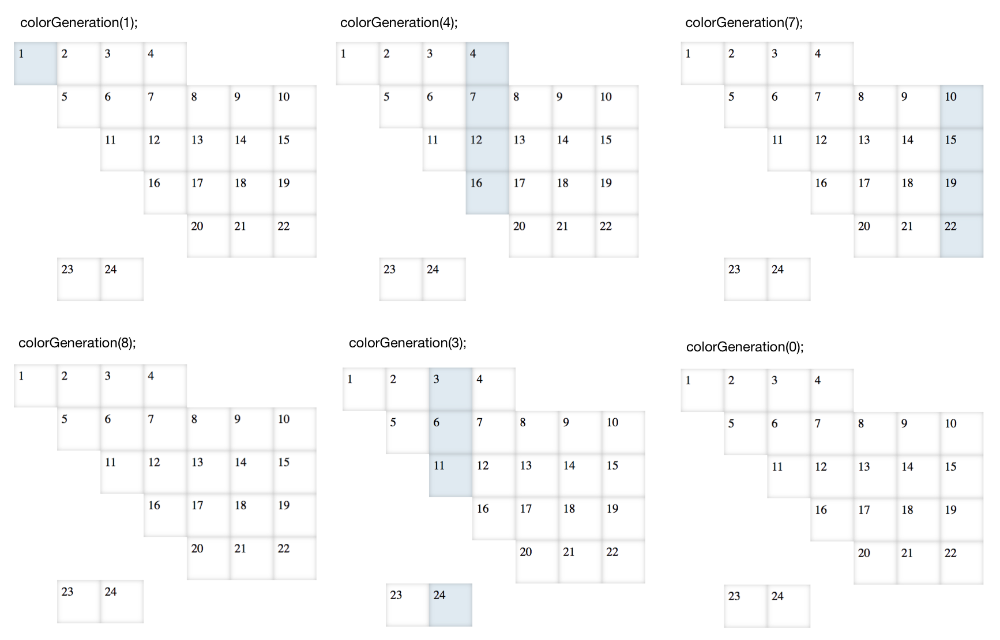

# Exercises: DOM Traversing, Querying, and Manipulation - 3/3/2021

## 1. Counting Nodes

Go over the two HTML snippets. How many nodes will the resulting DOM tree have?

```html
<div>
  <p>Then press the <em>Draw</em> button</p> 
</div>
```

```html
<div><p>Then press the <em>Draw</em> button.</p></div>
```


### Solution

The first snippet will have 11 nodes:

* `html`
* `head`
* `body`
* `div`
* text (`"\n"`)
* `p`
* text (`"Then press the"`)
* `em`
* text (`"Draw"`)
* text (`"button"`)
* text (`"\n"`)

The second snippet will have 9 nodes:

* `html`
* `head`
* `body`
* `div`
* `p`
* text (`"Then press the"`)
* `em`
* text (`"Draw"`)
* text (`"button"`)

---

## 2. Child Nodes

How many direct and indirect child nodes does each parent node — starting with the element with an id of `1` — have in the DOM generated by the following HTML:

```html
<div id="1">
  <h1 id="2">Hello, <em id="3">World</em></h1>
  <p id="4">
    Welcome to wonderland. This is an
    <span id="5">awesome</span> place.
  </p>
  <a href="#" id="6"><strong id="7">Enter</strong></a>
  <div id="8"><p id="9"><a href="#" id="10">Go back</a></p></div>
</div>
```

Consider the following when counting the direct and indirect child nodes for each parent node:

* Any DOM node that has at least one child node is a parent node.
* Indirect child nodes are the child nodes of child nodes.

### Solution

| ID  | Direct | Indirect |
|-----|--------|----------|
| 1.  | 9      | 7        |
| 2.  | 2      | 1        |
| 3.  | 1      | 0        |
| 4.  | 3      | 1        |
| 5.  | 1      | 0        |
| 6.  | 1      | 1        |
| 7.  | 1      | 0        |
| 8.  | 1      | 1        |
| 9.  | 1      | 1        |
| 10. | 1      | 0        |

#### Adjustments based on provided solution

The description was slightly unclear: indirect nodes don't just mean grandchildren, but any descendants. This changes the counts for elements 1 and 8:

| ID  | Direct | Indirect |
|-----|--------|----------|
| 1.  | 9      | 12       |
| 8.  | 1      | 2        |


---

#### Further Exploration

Write code that returns the number of direct and indirect child nodes for a given parent node as an array.

```
// sample output
> childNodes(1);
= [9, 12]
> childNodes(4);
= [3, 1]
> childNodes(9);
= [1, 1]
```

##### FE Solution

```javascript
function walk(root, callback) {
  callback(root);
  Array.from(root.childNodes).forEach(node => walk(node, callback));
}

function countChildren(id) {
  let parent = document.getElementById(id);
  let directChildCount = parent.childNodes.length;

  let indirectChildCount = -1;
  walk(parent, node => indirectChildCount += 1);

  return [directChildCount, indirectChildCount - directChildCount];
}
```

---

## 3. Tracing the DOM Tree

Write a JavaScript function that takes an element's `id` and returns the DOM tree of the element in a two-dimensional array. The first subarray contains the element and its siblings, the second contains the parent of the element and its siblings, so on and so forth, all the way up to the "grandest" parent. Assume that the grandest parent is the element with an `id` of `"1"`. Use the following HTML and test cases to test your code:

```html
<!doctype html>
<html>

<head>
  <title>Tracing the DOM Tree</title>
</head>

<body>
  <article id="1">1
    <header id="2">2
      <span id="3">3
        <a href="#" id="4">4</a>
      </span>
    </header>
    <main id="5">5
      <section id="6">6
        <p id="7">7
          <span id="8">8
            <strong id="9">9
              <a href="#" id="10">10</a>
            </strong>
          </span>
        </p>
      </section>
      <section id="11">11
        <p id="12">12
          <span id="13">13
            <strong id="14">14
              <a href="#" id="15">15</a>
            </strong>
          </span>
        </p>
        <p id="16">16
          <span id="17">17
            <strong id="18">18
              <a href="#" id="19">19</a>
            </strong>
          </span>
          <span id="20">20
            <strong id="21">21
              <a href="#" id="22">22</a>
            </strong>
          </span>
        </p>
      </section>
    </main>
    <footer id="23">23
      <p id="24">24</p>
    </footer>
  </article>
</body>

</html>
```

```
> domTreeTracer(1);
= [["ARTICLE"]]
> domTreeTracer(2);
= [["HEADER", "MAIN", "FOOTER"], ["ARTICLE"]]
> domTreeTracer(22);
= [["A"], ["STRONG"], ["SPAN", "SPAN"], ["P", "P"], ["SECTION", "SECTION"], ["HEADER", "MAIN", "FOOTER"], ["ARTICLE"]]
```

### Solution

```javascript
function reverseWalk(node, callback) {
  callback(node.parentElement.children);

  if (node.id !== '1') reverseWalk(node.parentElement, callback);
}

function domTreeTracer(id) {
  let tree = [];
  let start = document.getElementById(id);

  reverseWalk(start, nodes => {
    tree.push(Array.from(nodes).map(node => node.tagName));
  });

  return tree;
}
```

---

## 4. Tree Slicing

Implement a function, `sliceTree`, that is "similar" to the `Array.prototype.slice` method, but this time for a DOM tree. The `sliceTree` function takes two arguments: the start index which is the parent node's `id` attribute and, the end index which is the innermost child node's `id` attribute. The function returns an array of `tagNames`. Take note of the following when implementing the `sliceTree` function:

* It's similar to slice but different in the sense that `slice` isn't inclusive on the right hand side.
* The end index doesn't have to be the id of the "innermost" child node as some of the examples suggest.
* Only consider element nodes.
* Only elements that have `body` as an ancestor (parent, grandparent, etc.) are sliceable.
* If the `id` attribute of the start or end index is not in the DOM, return `undefined`.
* If the slice is not feasible — there's no path connecting the element at the starting index to the ending index — return `undefined`.

Use this HTML and sample run to test out your code:

```html
<!doctype html>
<html>
  <head>
    <title>Tree Slicing</title>
  </head>
  <body>
    <article id="1">1
      <header id="2">2
        <span id="3">3
          <a href="#" id="4">4</a>
        </span>
      </header>
      <main id="5">5
        <section id="6">6
          <p id="7">7
            <span id="8">8
              <strong id="9">9
                <a href="#" id="10">10</a>
              </strong>
            </span>
          </p>
        </section>
        <section id="11">11
          <p id="12">12
            <span id="13">13
              <strong id="14">14
                <a href="#" id="15">15</a>
              </strong>
            </span>
          </p>
          <p id="16">16
            <span id="17">17
              <strong id="18">18
                <a href="#" id="19">19</a>
              </strong>
            </span>
            <span id="20">20
              <strong id="21">21
                <a href="#" id="22">22</a>
              </strong>
            </span>
          </p>
        </section>
      </main>
      <footer id="23">23
        <p id="24">24</p>
      </footer>
    </article>
  </body>
</html>
```

```
> sliceTree(1, 4);
= ["ARTICLE", "HEADER", "SPAN", "A"]
> sliceTree(1, 76);
= undefined
> sliceTree(2, 5);
= undefined
> sliceTree(5, 4);
= undefined
> sliceTree(1, 23);
= ["ARTICLE", "FOOTER"]
> sliceTree(1, 22);
= ["ARTICLE", "MAIN", "SECTION", "P", "SPAN", "STRONG", "A"]
> sliceTree(11, 19);
= ["SECTION", "P", "SPAN", "STRONG", "A"]
```

> Numeric id values won't work as an argument for `querySelector`. Check out the SO post on [using numeric id attribute value as argument for `querySelector](https://stackoverflow.com/questions/20306204/using-queryselector-with-ids-that-are-numbers).

### Solution

```javascript
function queryId(id) {
  chars = String(id).split('');
  let escapedChars = chars.map(char => `\\3${char} `);
  return '#' + escapedChars.join('');
}

function sliceTree(startId, endId) {
  let start = document.getElementById(startId);
  let end = document.getElementById(endId);
  if (!(start && end)) return;

  if (!document.body.querySelector(queryId(startId))) return;
  if (!document.body.querySelector(queryId(endId))) return;
  if (!start.querySelector(queryId(endId))) return;

  let branch = [];
  let currentNode = end;

  while (currentNode !== start.parentElement) {
    branch.unshift(currentNode.tagName);
    currentNode = currentNode.parentElement;
  }

  return branch;
}
```

---

## 5. Coloring

Write a function that colors a specific generation of the DOM tree. A generation is a set of elements that are on the same level of indentation. We'll be using a ["styled"](https://dbdwvr6p7sskw.cloudfront.net/js-exercises/dom_querying_manipulation/tracing_the_dom_tree_styled.html) HTML for this exercise to better visualize the generations. You may use the `.generation-color` class to color the specific generation. You can assume that only non-negative integers will be provided as arguments. Following are some sample output to help you test your code:

```html
<!doctype html>
<html>

  <head>
    <title>Coloring</title>
    <style>
     body * {
         position: absolute;
         display: block;
         height: 50px;
         width: 50px;
         font-size: 14px;
         font-weight: normal;
         text-decoration: none;
         color: black;
         box-shadow: inset 0px 0px 8px -1px rgba(0,0,0,0.30);
     }

     article {
         margin-top: 10px;
         margin-left: 10px;
     }

     .child1x1, .child1x2, .child1x6, article {
         box-sizing: border-box;
         padding: 5px 0 0 5px;
     }

     .child1x1 {
         left: 50px;
         top: 0px;
     }

     .child1x2 {
         left: 50px;
         top: 50px;
     }

     .child1x6 {
         left: 50px;
         top: 250px;
     }

     .generation-color {
         background: #E0EAF1;
     }
    </style>
  </head>

  <body>
    <article id="1">1
      <header id="2" class="child1x1">2
        <span id="3" class="child1x1">3
          <a href="#" id="4" class="child1x1">4</a>
        </span>
      </header>
      <main id="5" class="child1x2">5
        <section id="6" class="child1x1">6
          <p id="7" class="child1x1">7
            <span id="8" class="child1x1">8
              <strong id="9" class="child1x1">9
                <a href="#" id="10" class="child1x1">10</a>
              </strong>
            </span>
          </p>
        </section>
        <section id="11" class="child1x2">11
          <p id="12" class="child1x1">12
            <span id="13" class="child1x1">13
              <strong id="14" class="child1x1">14
                <a href="#" id="15" class="child1x1">15</a>
              </strong>
            </span>
          </p>
          <p id="16" class="child1x2">16
            <span id="17" class="child1x1">17
              <strong id="18" class="child1x1">18
                <a href="#" id="19" class="child1x1">19</a>
              </strong>
            </span>
            <span id="20" class="child1x2">20
              <strong id="21" class="child1x1">21
                <a href="#" id="22" class="child1x1">22</a>
              </strong>
            </span>
          </p>
        </section>
      </main>
      <footer id="23" class="child1x6">23
        <p id="24" class="child1x1">24</p>
      </footer>
    </article>
  </body>
</html>
```

**\*Styling has no effect on the HTML structure.** It is purely for visualization purposes.



### Solution

```javascript
function walkUntil(root, currentDepth, maxDepth, callback) {
  let children = Array.from(root.children);

  if (currentDepth + 1 === maxDepth) {
    children.forEach(callback);
  } else {
    currentDepth += 1;
    children.forEach(child => walkUntil(child, currentDepth, maxDepth, callback));
  }
}

function colorGeneration(generation) {
  walkUntil(document.body, 0, generation, node => {
    node.classList.add('generation-color');
  });
}
```

---

## 6. Node Swap

Write a function that takes two element `id`s as arguments and swaps the positions of the elements represented by the `id`s. The function returns `true` for valid swaps and `undefined` for invalid. To put the focus on the node swapping functionality, you can assume that nodes will have a value for the `id` attribute and two arguments will always be provided. Use the following HTML and sample codes to test your output:

```html
<!doctype html>
<html>
  <head>
    <title>Node Swap</title>
  </head>
  <body>
    <div id="1">
      <div id="4"></div>
      <div id="5">
        <div id="6"></div>
      </div>
    </div>
    <div id="2"></div>
    <div id="3">
      <div id="7"></div>
      <div id="8"></div>
      <div id="9"></div>
    </div>
  </body>
</html>
```

### Invalid Swaps

```
// at least one of the id attributes doesn't exist
> nodeSwap(1, 20);
= undefined

// at least one of the nodes is a "child" of the other
> nodeSwap(1, 4);
= undefined
> nodeSwap(9, 3);
= undefined
```

### Valid Swaps

```
// one swap
> nodeSwap(1, 2);
```

```html
<!doctype html>
<html>
  <head>
    <title>Node Swap</title>
  </head>
  <body>
    <div id="2"></div>
    <div id="1">
      <div id="4"></div>
      <div id="5">
        <div id="6"></div>
      </div>
    </div>
    <div id="3">
      <div id="7"></div>
      <div id="8"></div>
      <div id="9"></div>
    </div>
  </body>
</html>
```

```
// multiple swaps
> nodeSwap(3, 1);
> nodeSwap(7, 9);
```

```html
<!doctype html>
<html>
  <head>
    <title>Node Swap</title>
  </head>
  <body>
    <div id="3">
      <div id="9"></div>
      <div id="8"></div>
      <div id="7"></div>
    </div>
    <div id="2"></div>
    <div id="1">
      <div id="4"></div>
      <div id="5">
        <div id="6"></div>
      </div>
    </div>
  </body>
</html>
```

### Solution

```javascript
function nodeSwap(firstId, secondId) {
  let first = document.getElementById(firstId);
  let second = document.getElementById(secondId);
  if (!(first && second)) return undefined;

  if (first.parentElement === second || second.parentElement === first) {
    return undefined;
  }

  let firstCopy = first.cloneNode(true);
  let secondCopy = second.cloneNode(true);

  first.parentElement.replaceChild(secondCopy, first);
  second.parentElement.replaceChild(firstCopy, second);

  return true;
}
```

#### Further Exploration

The current solution clones the nodes and uses the `.replaceChild` method to handle the swapping. The limitation of this approach, however, is that the nodes will lose all event listeners attached to it via JavaScript. For further exploration, refactor/implement a solution wherein the swapped nodes don't lose event listeners — if any — added via JavaScript.

##### FE Solution

You can preserve event listeners by using a temporary placeholder node instead of cloning nodes. I put together some quick and dirty styling to verify that an `onclick` listener is preserved:

```javascript
Array.from(document.getElementsByTagName('div')).forEach(div => {
  div.style.border = '2px black solid';
  div.style.color = 'orange';
  div.style.height = '30px';
  div.style.width = '30px';
});

function nodeSwap(firstId, secondId) {
  const first = document.getElementById(firstId);
  const second = document.getElementById(secondId);
  if (!(first && second)) return undefined;

  if (first.parentElement === second || second.parentElement === first) {
    return undefined;
  }

  const temp = document.createElement(first.tagName);

  first.onclick = e => alert('AAAAHHHH!');

  first.parentElement.replaceChild(temp, first);
  second.parentElement.replaceChild(first, second);
  temp.parentElement.replaceChild(second, temp);

  return true;
}
```

---

## 7. Nodes to Array

Implement a function that converts the DOM, starting from the `body`, to nested arrays. Each element in the DOM is represented as `["PARENT_TAG_NAME", [children]]` where children are elements as well and as such follow the same format. When an element has no children, it's represented as `["PARENT_TAG_NAME", []]`. For instance, if the HTML doesn't have any elements inside the `body`, the result array would be: `["BODY", []]`. Likewise, if the HTML only has a `div` element as its content, the result array would be: `["BODY", [["DIV", []]]]`.

Go over the examples below to better visualize how the DOM is represented as nested arrays.

```html
<!doctype html>
<html>
  <head>
    <title>Nodes to Array</title>
  </head>
  <body>
    <header id="1"></header>
    <main id="2"></main>
    <footer id="3"></footer>
  </body>
</html>
```

```
> nodesToArr();
= ["BODY",[["HEADER",[]],["MAIN",[]],["FOOTER",[]]]]

// OR

= ["BODY", [
    ["HEADER", []],
    ["MAIN", []],
    ["FOOTER", []]]]
```

```html
<!doctype html>
<html>
  <head>
    <title>Nodes to Array</title>
  </head>
  <body>
    <header id="1"></header>
    <main id="2">
      <div></div>
      <div></div>
    </main>
    <footer id="3"></footer>
  </body>
</html>
```

```
> nodesToArr();
= ["BODY",[["HEADER",[]],["MAIN",[["DIV",[]],["DIV",[]]]],["FOOTER",[]]]]

// OR

= ["BODY", [
    ["HEADER", []],
    ["MAIN", [
      ["DIV", []],
      ["DIV", []]]],
    ["FOOTER",[]]]]
```

```html
<!doctype html>
<html>
  <head>
    <title>Nodes to Array</title>
  </head>
  <body>
    <div id="1">
      <div id="4"></div>
      <div id="5">
        <div id="6"></div>
      </div>
    </div>
    <div id="2"></div>
    <div id="3">
      <div id="7"></div>
      <div id="8"></div>
      <div id="9"></div>
    </div>
  </body>
</html>
```

```
> nodesToArr();
= ["BODY",[["DIV",[["DIV",[]],["DIV",[["DIV",[]]]]]],["DIV",[]],["DIV",[["DIV",[]],["DIV",[]],["DIV",[]]]]]]

// OR

= ["BODY", [
    ["DIV", [
      ["DIV", []],
      ["DIV", [
        ["DIV",[]]]]]],
    ["DIV", []],
    ["DIV", [
      ["DIV", []],
      ["DIV", []],
      ["DIV", []]]]]]
```

### Solution

```javascript
function nodeToArr(node) {
  let parent = node.tagName;
  let children = Array.from(node.children).map(child => nodeToArr(child));
  return [parent, children];
}

function nodesToArr() {
  return nodeToArr(document.body);
}
```

---

## 8. Array to Nodes

> This is a challenging exercise. You may opt not work on it. We will not have problems of this level of difficulty in the exams.
>
> The challenge is mainly because of the logic/mental model for it can be tough to visualize right away. Once you've got a mental model the code isn't long and complex.

Implement a function that converts a nested array of `nodeNames` (see Nodes to Array exercise for examples) to nodes. Go over the sample code and the corresponing return values below as a guide for what you will implement.

```javascript
// Nested array of nodes
const nodes = ["BODY",[["HEADER",[]],["MAIN",[]],["FOOTER",[]]]];

// OR
//
// ["BODY", [
//   ["HEADER", []],
//   ["MAIN", []],
//   ["FOOTER", []]]]

arrayToNodes(nodes);
```

```html
<body>
  <header></header>
  <main></main>
  <footer></footer>
</body>
```

```javascript
// Nested array of nodes
const nodes = ["BODY",[["DIV",[["DIV",[]],["DIV",[["DIV",[]]]]]],["DIV",[]],["DIV",[["DIV",[]],["DIV",[]],["DIV",[]]]]]];

// OR
//
// ["BODY", [
//   ["DIV", [
//     ["DIV", []],
//     ["DIV", [
//       ["DIV",[]]]]]],
//   ["DIV", []],
//   ["DIV", [
//     ["DIV", []],
//     ["DIV", []],
//     ["DIV", []]]]]]

arrayToNodes(nodes);
```

```html
<body>
  <div>
    <div></div>
    <div>
      <div></div>
    </div>
  </div>
  <div></div>
  <div>
    <div></div>
    <div></div>
    <div></div>
  </div>
</body>
```

> Hint1: This problem lends itself well to using recursion since the level of nested arrays of nodes isn't known.

> Hint2: The challenge with recursion is thinking of the base case and how to work towards the base case. One base case is when a parent node has no more child nodes.


### Solution

```javascript
function arrayToNodes(nodes) {
  [parent, children] = nodes;
  parent = document.createElement(parent);

  if (children.length > 0) {
    children.forEach(childArray => {
      parent.appendChild(arrayToNodes(childArray));
    });
  }

  return parent;
}
```

---

## 9. Work Back

Given the JavaScript code below, create the corresponding HTML that results to the same logs to the console when executed in sequence.

```
> console.log(document.head.childNodes.length);
= 3
> console.log(document.head.children[0].tagName);
= 'TITLE'
> console.log(document.head.textContent);
= "
      Title
    "
> console.log(document.body.children.length);
= 3
> console.log(document.body.childNodes.length);
= 5
> console.log(document.querySelector('div').parentNode.parentNode.tagName);
= 'BODY'
> console.log(document.querySelector('div section').children[2].nextElementSibling);
= null
> console.log(document.querySelectorAll('div').length);
= 1

> var nodeA = document.body.firstElementChild;
> console.log(document.querySelector('footer').children.length);
= 1
> console.log(document.querySelector('body').replaceChild(
>   document.querySelector('footer'), document.body.firstElementChild).tagName);
= 'HEADER'
> console.log(document.body.appendChild(nodeA));
= <header>Header<header>

> console.log(document.querySelector('section').textContent.split("\n").map(function(text) {
>   return text.trim();
> }).filter(function(text) {
>   return text.length > 0;
> }));
= ["H1", "Hello", "World"]

> console.log(document.querySelector('section').children);
= HTMLCollection(3) [h1, p, p]
> console.log(document.querySelector('section').textContent);
= "
            H1
            Hello
            World
          "

> console.log(document.querySelector('span.emphasis').parentNode.tagName);
= 'FOOTER'
```

> Hint: It can be overwhelming to piece back the entire HTML from looking at all the code that was executed. One approach is to take it one execution at time and regularly update the HTML such that all logs are matched.

### Solution

`> console.log(document.body.children.length); // 3` indicates that there are three element children of `body`, but only `header` and `footer` are specified. The other might be a `p` element, but other `p` elements are nested inside a semantic container. It can't be a `div` because there's only one. It could maybe be a `section`, but that creates ambiguity with some of the other code. I'm going to make it an `article` for now for the sake of getting the HTML page shown without errors so I can test the code in sequence, but this second element child of `body` is not necessarily an `article`.

```html
<!doctype html>
<html>
  <head>
    <title>Title</title>
  </head>
  <body>
    <header>Header</header><article>
      <div>
        <section>
          <h1>H1</h1>
          <p>Hello</p>
          <p>World</p>
        </section>
      </div>
    </article><footer>
      <span class="emphasis">maybe just text?</span>
    </footer>
  </body>
</html>
```

#### Adjustments based on provided solution

The unknown element I made an `article` for the purposes of getting the page to display without errors is shown as `main` in the provided solution, which can't be inferred from the provided code but is more semantically appropriate.

---

## 10. HTML Imaging

Read the JavaScript code below. Given the code, create the HTML that matches the DOM rendered by the browser. You don't need to account for the text nodes when creating the HTML. The challenge of this exercise is trying to picture what the HTML will be without running the code. At the very least, try attempting it first with pen and paper. Assume that the following HTML is the starting point:

```html
<!doctype html>
<html>
  <head>
    <title>HTML Imaging</title>
  </head>
  <body>
  </body>
</html>
```

```javascript
const node1 = document.createElement('header');
const node2 = document.createTextNode('Dynamic Content');

node1.innerHTML = '<p>Hello World!</p>';
document.body.appendChild(node1);
document.body.firstElementChild.insertBefore(node2, node1.firstElementChild);

const node3 = document.createElement('h1');
node3.appendChild(node2);
document.body.firstElementChild.insertBefore(node3, node1.firstElementChild);

node1.setAttribute('id', 'header');
node3.classList.add('emphasis');
node3.classList.add('light');

const node4 = document.createElement('style');
const css1 = ".emphasis { font-weight: bold; }";
const css2 = ".light { color: gray; }";
node4.type = 'text/css';

node4.appendChild(document.createTextNode(css1));
node4.appendChild(document.createTextNode(css2));

document.head.appendChild(node4);
```

### Solution

```html
<!doctype html>
<html>
  <head>
    <title>HTML Imaging</title>
    <style type="text/css">
      .emphasis { font-weight: bold; }
      .light { color: gray; }
    </style>
  </head>
  <body>
    <header id="header">
      <h1 class="emphasis light">Dynamic Content</h1>
      <p>Hello World!</p>
    </header>
  </body>
</html>
```
