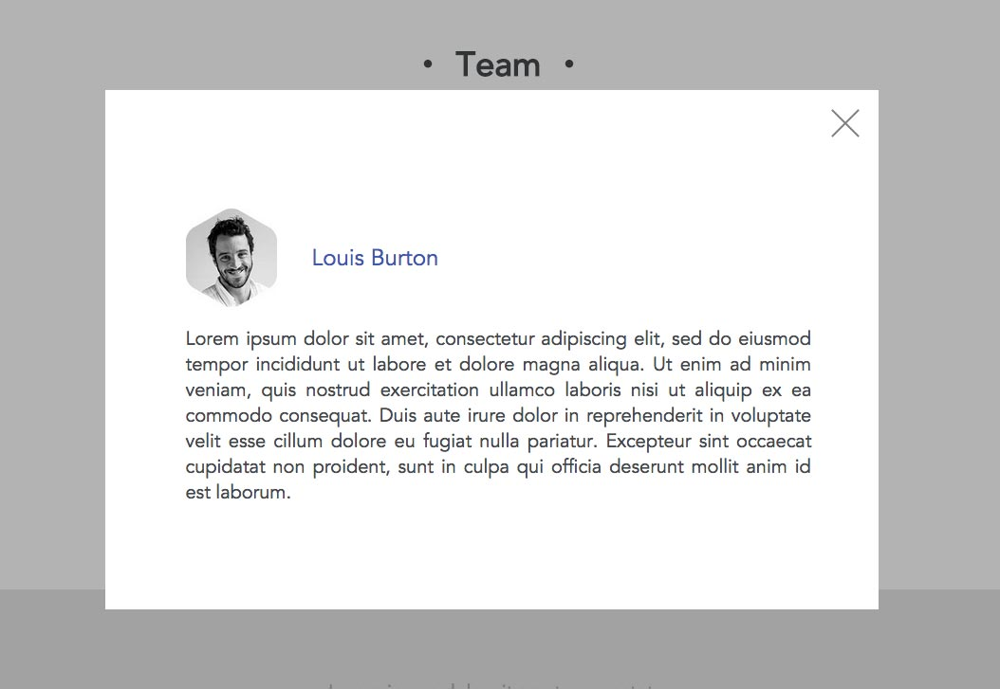

# Assignment: Team Member Profile Modals - 3/25/2021

We're going to revisit our Space Design website from an earlier course, and add more information about our team members. Our designer has come up with a common means of displaying more information as an overlay on the page content, called a modal. A modal acts like a separate sub-window of content that can be closed in order to return to the main content, all without leaving the page. These always use CSS positioning to place the modal and an optional overlay element over the top of the content. The overlay acts as a blocking element to prevent interacting with the page underneath the modal. It is good practice to have at least a close link and a close action bound to clicking on the overlay that will remove the modal and the overlay.

> Here's a [link](https://d3jtzah944tvom.cloudfront.net/lesson_3/company_site_responsive_breakpoints/company_site.zip) to the completed Space Design website from the HTML/CSS course. You may opt to start from this if you don't have yours readily available.

The modal we'll create will look like this:



The close link in the top right corner will be made with the following image.


### Possible Approaches

There are a few different approaches you could take in order to implement the modal, including:

1. One option would be to mark-up a modal (including the relevant content) for each team member, and then show the appropriate modal when that team member's list item is clicked.
2. Another option would be to mark-up a single modal element that is shown when any team member list item is clicked, and then dynamically set the content for the modal depending on which team member was clicked.

### Positioning the Modal

We want the modal to be horizontally centered, but when an element is absolute or fixed position, we can't use the typical method. We'll have to instead position it from the left edge 50% of the way across the screen, then set a left margin equal to half the modal's width, in a negative value. If the modal is 400px wide, for example, we'd use:

```css
#modal {
  position: absolute;
  left: 50%;
  width: 400px;
  margin-left: -200px;
}
```

### Animating the Modal

For some extra polish, have the modal and overlay fade in and out. If using jQuery, investigate the various [animation effects](https://api.jquery.com/category/effects/) that the library provides. If using CSS animations, the common method of starting an animation is to toggle a class on an element to be animated and using a [transition](https://developer.mozilla.org/en-US/docs/Web/CSS/transition) for the property being animated.

* You could also experiment with having the element slide in from one side of the screen.
* Another thing you can do is add a `keyup` listener to the page that will close the modal if the escape key is pressed.

### Solution

[team.html](team.html)
[site.css](site.css)
[team.js](team.js)

#### Adjustments based on provided solution

Toggling classes to show/hide the modal can be done in one statement with `classList.replace` instead of `classList.remove` and then `classList.add`.
