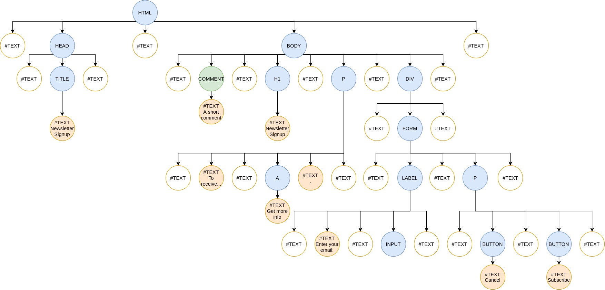

# The DOM - 3/1/2021

## Problems

### 1. True or False: there is a direct one-to-one mapping between the tags that appear in an HTML file and the nodes in the DOM.


#### Solution

False: HTML tags do become element nodes, but text, including whitespace between HTML elements, also becomes text nodes.

##### Adjustments based on provided solution

The browser may also insert additional nodes that were missing from invalid markup or were optionally omitted.

---

### 2. True or False: Text nodes sometimes contain nothing but whitespace.

#### Solution

True.

---

### 3. Given the HTML shown below, draw the DOM that the browser will construct when it loads the HTML. Determine which nodes are:

* elements,
* text nodes with nothing but whitespace
* text nodes containing text,
* or [comments](https://developer.mozilla.org/en-US/docs/Web/API/Comment).

```html
<html>
  <head>
    <title>Newsletter Signup</title>
  </head>
  <body>
    <!-- A short comment -->
    <h1>Newsletter Signup</h1>
    <p class="intro" id="simple">
      To receive our weekly emails, enter your email address below.
      <a href="info.html">Get more info</a>.
    </p>
    <div class="form">
      <form>
        <label>
          Enter your email:
          <input name="email" placeholder="user.name@domain.test"/>
        </label>
        <p class="controls">
          <button id="cancelButton">Cancel</button>
          <button type="submit" id="submitButton">Subscribe</button>
        </p>
      </form>
    </div>
  </body>
</html>
```

#### Solution



##### Adjustments based on provided solution

The provided solution has fewer whitespace nodes, but it's not immediately clear why, and this seems to contradict documentation seen [here](https://developer.mozilla.org/en-US/docs/Web/API/Document_Object_Model/Whitespace). TODO: Test whitespace and comments once I've gotten practice with the DOM.

Based on the next lesson, it looks like the places where I have a whitespace text node next to a text node with content, the browser in reality combines those into a single text node.

---

### 4. Update the drawing from the previous question to show the values of each text node.

#### Solution

I already did this; see the previous solution.
